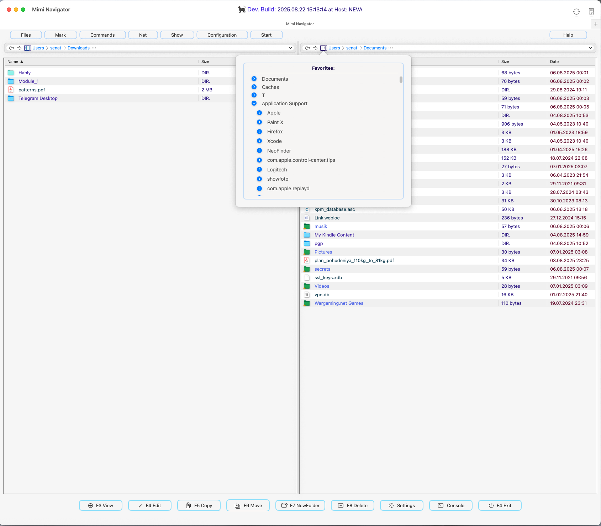

<div style="text-align: center;">
  
</div>


> 💡 ***If you are only interested in the source code implementation of this app, you can explore it directly here:***  
> <span style="color:#8B0000; font-weight:bold;">👉 [MiMiNavigator / GUI / Sources](https://github.com/senatov/MiMiNavigator/tree/master/GUI/Sources)</span>


---
### MiMiNavigator - MacOS File manager with two panels
## (NOT READY YET, still under Development)


[](https://swift.org)
[](https://developer.apple.com/xcode/)
[](LICENSE)
[](https://www.apple.com/macos/)
[](https://developer.apple.com/xcode/swiftui/)
[](https://www.apple.com/mac-studio/)
[]()
[]()
[]()
[]()


---
##     Overview
MiMiNavigator is a macOS file manager built with Swift and SwiftUI.
The repository is organized around an Xcode project with sources under `MiMiNavigator/` and basic tests in `MiMiNavigatorTests` and `MiMiNavigatorUITests`.

<div style="text-align: center;" >
  
</div>


---
### General structure

Key directories inside `MiMiNavigator/`:

- **App** entry point and logging setup. The application reads a `.version` file, sets up a shared model container, and displays a main split view UI with a log viewer button. The code uses SwiftyBeaver for logging.

- **States** observable classes and actors that hold runtime state. `AppState` tracks the current directories and selected files, while `DualDirectoryScanner` scans both panels using timers and async updates.

- **Models** data structures such as `CustomFile`, an entity representing files or directories, and `FileSingleton`, an actor maintaining left/right file lists for SwiftUI updates.

- **Views** SwiftUI views for file panels, the top menu bar, and toolbar. `TotalCommanderResizableView` composes the main UI with a draggable divider and toolbar buttons for actions like view, edit, copy, and delete.

- **BreadCrumbNav** editable path controls and breadcrumb navigation.

- **Favorite** scans frequently used directories and mounted volumes to show a favorites tree.

- **Menus** menu item models and top menu rendering.

Other resources include asset catalogs, entitlements files, and a `refreshVersionFile.zsh` script that updates the `Gui/curr_version.asc` string.


---
### Important aspects

- **Concurrency** Directory scanning and file updates are handled by actors (`DualDirectoryScanner`, `FileSingleton`) and async tasks to keep the UI responsive.

- **User preferences** Window sizes, panel widths, and other state are stored using `UserPreferences`(UserDefaults wrappers).

- **Logging** `LogMan` sets up **SwiftyBeaver** console and file logging with custom icons for log levels.

- **Customization** Many UI components (menu buttons, path control, tooltip) are implemented as reusable **SwiftUI** views.

---
### Getting started

1. Clone the repository and open `MiMiNavigator.xcodeproj` in Xcode.

2. Build and run. The README outlines basic installation steps and features such as dual panel navigation and periodic directory scanning.

3. The main entry point is `MiMiNavigatorApp` which initializes logging and sets up the main view hierarchy. Explore `AppState` and `DualDirectoryScanner` to understand how directory changes propagate to the UI.

---
### Learning pointers

- **SwiftUI layout and modifiers** Many views use custom modifiers and gestures (e.g., `onHover`, drag gestures for the divider).

- **Actors and concurrency** `DualDirectoryScanner` demonstrates using timers inside an actor for periodic work.

- **AppKit interop** Some components rely on `NSWorkspace`, `NSAlert`, and other AppKit APIs for macOS 16.4 specific functionality.

- **Persistent data** The app uses SwiftData `ModelContainer` for future persistence, though currently the `Item`model is minimal.

This project is still under active development ( NOT READY YET  per the README) but provides a clear example of a SwiftUI macOS application with multithreading, logging, and modular UI components.

---
## Current Stage

-  Support for macOS 26 with Swift 6.2 beta5.
-  Periodic directory scanning and updating, using dynamic collections for real-time content refresh.
-  Modular and reusable components for top navigation.
-  Integrated file management actions including copy, rename, and delete.
-  Full Total Commander submenu structure recreated.
-  Dynamic output naming in shell utilities.
-  Dual-panel interface for managing files and directories.
-  Automatic UI updates when directory contents change.


---
## Requirements

- macOS 26 or later
- Swift 6.2
- Xcode 26.1 beta 


---
##  Installation

1. Clone the repository:
    ```sh
    git clone https://github.com/username/MiMiNavigator.git
    cd MiMiNavigator
    ```
2. Open the project in Xcode:
    ```sh
    open MiMiNavigator.xcodeproj
    ```
3. Build and Run through Xcode or with the command:
    ```sh
    xcodebuild -scheme MiMiNavigator -configuration Debug CODE_SIGNING_ALLOWED=YES
    ```
4. Check sources
    ```sh
    periphery scan --project MiMiNavigator.xcodeproj --schemes MiMiNavigator
    ```


---
 ## Usage

1. Launching: Open the application and set directories for dual-panel mode.
2. File Operations:
    - Copy: Use the `Copy` option in the context menu for quick file duplication.
    - Rename: Select `Rename` and specify the new name.
    - Delete: Use `Delete` to move the file to the trash.
3. Automatic Updates: The application will periodically scan the specified directories and refresh content in real time.


---
## Authors

- Iakov Senatov:  [](https://www.linkedin.com/in/iakov-senatov-07060765)

| Step                | Description                                                                                    |
| ------------------- | ---------------------------------------------------------------------------------------------- |
| Installation        | Clone the repository, navigate to the project directory, and install dependencies as required. |
| Running the Project | Use the command `swift run` to launch the project.                                             |
| Usage               | Access features like configuration, file management, network, and tools from the main menu.    |


---
## FAQ

| Question                             | Answer                                                                    |
| ------------------------------------ | ------------------------------------------------------------------------- |
| How to configure settings?           | Navigate to Configuration to access display, layout, and color settings.  |
| How to compare directories?          | Use the Files menu to compare and sync directories.                       |
| Can I rename multiple files at once? | Yes, use the Multi-Rename Tool available under Tools.                     |
| Is FTP supported?                    | Yes, FTP connection tools are available under the Network menu.           |
| Clean the Project from artefacts     | periphery scan --config .periphery.yml                                    |


---
## Recent Changes
```sh

* 5bf0ea5 - Senatov  (HEAD -> master) R-Mouse mnu ,fix focus jump on down selection (2 hours ago, 2025-10-26 19:15:22 +0100)
* 602b0a9 - Senatov  (origin/master, origin/HEAD) logs, fix styles, macOS 26.1 liquid glass style (22 hours ago, 2025-10-25 23:53:40 +0200)
* 8df17a9 - Senatov  scweinkram (23 hours ago, 2025-10-25 23:11:33 +0200)
* a81a9b2 - Senatov  The left and right sides get mixed up when I click on “Navigation between favorites” — apparently it’s caused by favoritePopover() (27 hours ago, 2025-10-25 19:20:38 +0200)
* c5e6d9f - Senatov  security bookmarks (28 hours ago, 2025-10-25 18:18:07 +0200)
* ec7edfe - Senatov  UX Design fix (28 hours ago, 2025-10-25 17:51:41 +0200)
* d939f0f - Senatov  Excellent. Everything works! Navigation with mouse and Tab (31 hours ago, 2025-10-25 15:07:54 +0200)
* 169da9f - Senatov  save between fixies (works wrong) (2 days ago, 2025-10-24 17:08:55 +0200)
* b8b8513 - Senatov  history ok. Но выделение строки и низ по-прежнему дерьмово провисает. (3 days ago, 2025-10-23 23:01:17 +0200)
* 8491639 - Senatov  FileTableView   - err (3 days ago, 2025-10-23 20:03:08 +0200)
* 2324bf2 - Senatov  error (3 days ago, 2025-10-23 19:04:14 +0200)
* c6f9938 - Senatov  compillation error (3 days ago, 2025-10-23 18:41:21 +0200)
* f2c227e - Senatov  build info (3 days ago, 2025-10-23 15:38:37 +0200)
*   b9ac683 - Senatov  Merge branch 'check_popups_fix' (3 days ago, 2025-10-23 15:35:08 +0200)
|\  
| * 1fdce74 - Senatov  (origin/check_popups_fix, check_popups_fix) ok. Not tested yet! (3 days ago, 2025-10-23 15:29:09 +0200)
| * 0492725 - Senatov  Fix popup on prozess. Selection focuser panel side in logs with "<< >>" (3 days ago, 2025-10-23 14:25:40 +0200)
| * a087fa6 - Senatov  def. fixed before test (4 days ago, 2025-10-23 05:11:43 +0200)
| * 9ba4e47 - Senatov  wrong (4 days ago, 2025-10-23 04:52:03 +0200)
| * dce701f - Senatov  just try fix popup. Hasnt successfull. (5 days ago, 2025-10-21 21:20:07 +0200)
* | 26b1be3 - Senatov  wrong (4 days ago, 2025-10-23 04:18:43 +0200)
* | 46e4a71 - Senatov  colors, Styles - ok. Working on popup panel - not ok yet (4 days ago, 2025-10-22 14:24:08 +0200)
* | a19d8bf - Senatov  fix deive popup. in process (5 days ago, 2025-10-22 00:35:38 +0200)
* | 55a6778 - Senatov  something 2 Weeks old, don't know (5 days ago, 2025-10-21 17:05:02 +0200)
|/  
* e5671b8 - Senatov  UIViewRepresentable was need only f. SwiftUI 5 (2 weeks ago, 2025-10-09 18:34:33 +0200)
* 577fd9f - Senatov  opening ok. Ugly popup fav. self w. ugly closed functional err. (2 weeks ago, 2025-10-09 15:18:52 +0200)
* 8661332 - Senatov  renaming. Tests OK (2 weeks ago, 2025-10-09 14:53:05 +0200)
* c9cb18c - Senatov  Update README.md (3 weeks ago, 2025-10-09 03:59:15 +0200)
* d6b5fc3 - Senatov  Style macos 26 w. Figma (3 weeks ago, 2025-10-09 02:31:17 +0200)
* 9ec5308 - Senatov  R-Mouse f. Files & Directories in both Panels (3 weeks ago, 2025-10-08 22:07:22 +0200)
* 2f78aa9 - Senatov  1. fill color 2. selection/navigation - problem closed 3. try remove double coloring in selection (3 weeks ago, 2025-10-08 15:48:29 +0200)
* a1566d6 - Senatov  scroll & Tab - works (3 weeks ago, 2025-10-03 20:03:38 +0200)
* 759bb22 - Senatov  before reconfig (3 weeks ago, 2025-10-03 19:30:32 +0200)
* f725cd5 - Senatov  yet better  fixed scrolling + tabbing (3 weeks ago, 2025-10-03 10:43:21 +0200)
* 12aa0e4 - Senatov  tmp (ver) (3 weeks ago, 2025-10-02 19:37:49 +0200)
* db78b41 - Senatov  The "Tab" System hook works (4 weeks ago, 2025-10-01 19:31:44 +0200)
* 78bfb90 - Senatov  big blue focus frame fixed (4 weeks ago, 2025-10-01 01:42:59 +0200)
* 012a850 - Senatov  toogle panel fix (4 weeks ago, 2025-09-30 20:57:57 +0200)
* 75cb07f - Senatov  cnhg logging (4 weeks ago, 2025-09-28 22:53:12 +0200)
* 63e65ed - Senatov  Err. on Tab - not fixed (4 weeks ago, 2025-09-28 18:13:24 +0200)
* d9c31f9 - Senatov  new hist. collection package, panels navigation I + fix sel. history file (4 weeks ago, 2025-09-28 14:41:41 +0200)
*   897352e - Senatov  Merge branch 'new_fix' (4 weeks ago, 2025-09-28 14:27:17 +0200)
|\  
| * aff10ad - Senatov  Tab not works, up/down works so-so. Shit! (4 weeks ago, 2025-09-28 14:22:08 +0200)
| | * cbaf596 - Senatov  (refs/stash) On master: just repair prj func. bugs (4 weeks ago, 2025-09-28 14:26:45 +0200)
| |/| 
|/| | 
| | * 7a30f4c - Senatov  index on master: 07160d1 "selection" w. mouse & Tab on FilePanels (4 weeks ago, 2025-09-28 14:26:45 +0200)
| |/  
|/|   
* | 07160d1 - Senatov  "selection" w. mouse & Tab on FilePanels (5 weeks ago, 2025-09-24 17:05:36 +0200)
|/  
* 1c8a5de - Senatov  paths navigation / panel change (5 weeks ago, 2025-09-23 20:45:13 +0200)
* b1c5d72 - Senatov  optimize it (5 weeks ago, 2025-09-23 10:50:58 +0200)

```


---
 ##  Related Links

- [(NOT READY YET, still under Development)](#not-ready-yet-under-development----)
- [Overview](#overview)
  - [General structure](#general-structure)
  - [Important aspects](#important-aspects)
  - [Getting started](#getting-started)
  - [Learning pointers](#learning-pointers)
- [Current Stage](#current-stage)
- [Requirements](#requirements)
- [Installation](#installation)
- [Usage](#usage)
- [Authors](#authors)
- [FAQ](#faq)
- [Recent Changes](#recent-changes)
- [Related Links](#related-links)
