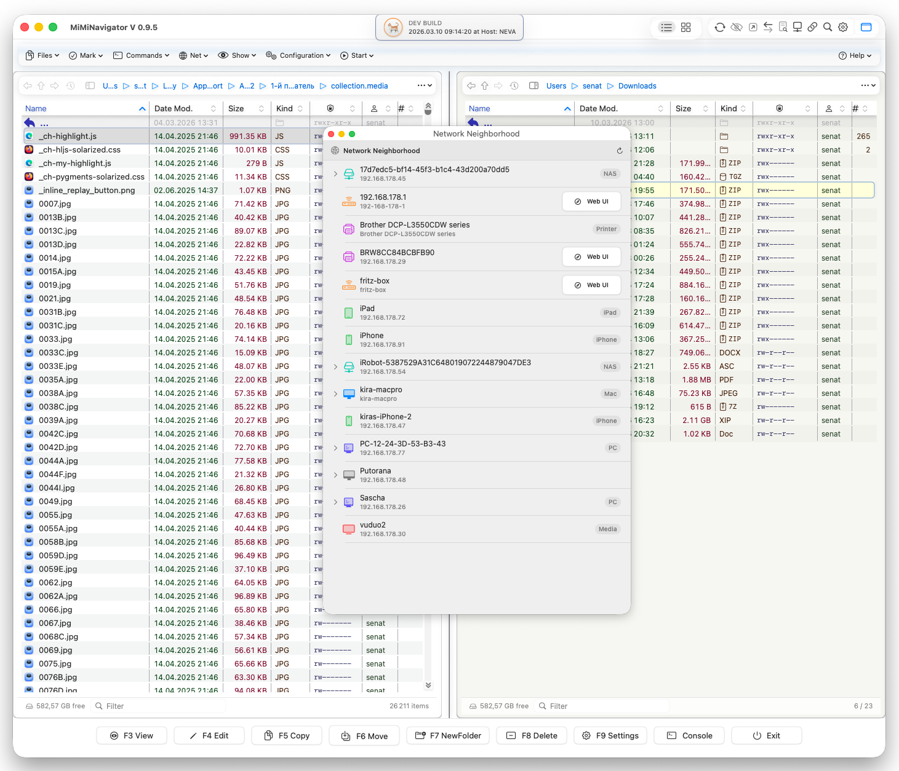
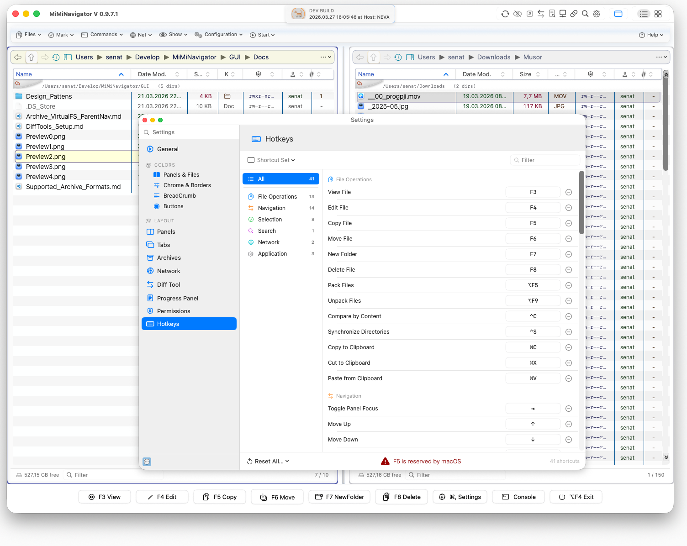
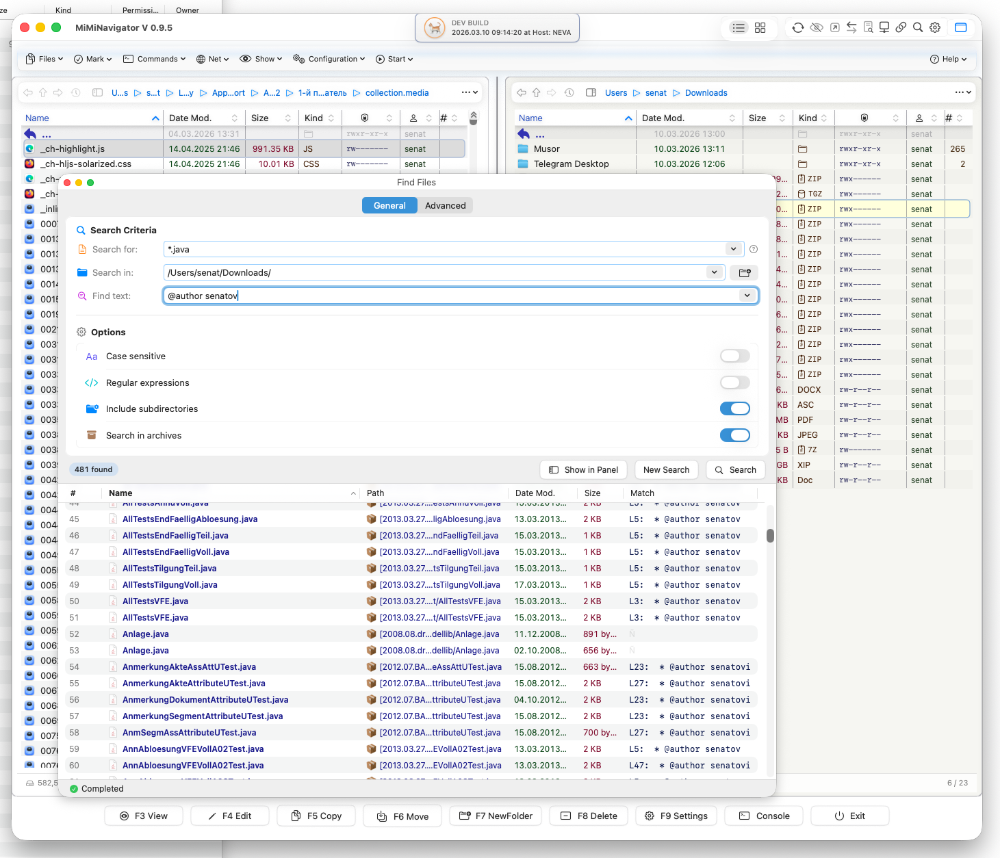

<h1 align="center">MiMiNavigator</h1>
<p align="center">
  <strong>Modern dual-panel file manager for macOS built with SwiftUI</strong>
</p>

<p align="center">
  <a href="https://github.com/senatov/MiMiNavigator">
    
  </a>
  
  
  
  
  
  
  
  
  
</p>

<div style="text-align: center;">
  
</div>

<p align="center">
  <a href="#features">Features</a> •
  <a href="#whats-new">What's New</a> •
  <a href="#screenshots">Screenshots</a> •
  <a href="#installation">Installation</a> •
  <a href="#architecture">Architecture</a> •
  <a href="#development">Development</a> •
  <a href="#contributing">Contributing</a> •
  <a href="#roadmap">Roadmap</a>
</p>

---

⚠️ **Development Status**
MiMiNavigator is currently under active development and **not yet ready for production use**.
APIs, layouts, and internal structures may change without prior notice.
Please use at your own discretion.

---

### Disclaimer
I am not an architecture expert and do not claim to be one.
If you notice mistakes or disagree with my methods, reasoning, or learning process,
I welcome your feedback via email or social media.
Much of what follows represents my first attempts in this area,
so I ask for your patience and indulgence.

---

### Transparency
I openly acknowledge that I have used AI assistants
to help clarify the philosophies and implementations of different architectures.

## 📖 Table of Contents

- [Overview](#overview)
- [What's New in v0.9.0](#whats-new-in-v090)
- [Why MiMiNavigator?](#why-miminavigator)
- [Features](#features)
- [Screenshots](#screenshots)
- [Requirements](#requirements)
- [Installation](#installation)
- [Quick Start](#quick-start)
- [Architecture](#architecture)
- [Development](#development)
- [Technologies & Patterns](#technologies--patterns)
- [Performance](#performance)
- [Roadmap](#roadmap)
- [Contributing](#contributing)
- [CI/CD](#cicd)
- [FAQ](#faq)
- [License](#license)
- [Acknowledgments](#acknowledgments)

## Overview

**MiMiNavigator** is a modern dual-panel file manager for macOS, designed to explore advanced SwiftUI patterns while providing an efficient file management experience. Inspired by classic dual-panel file managers like Total Commander and Norton Commander, MiMiNavigator reimagines the concept using native macOS technologies and modern Swift concurrency.

### Key Goals

- **Native macOS Experience**: Built entirely with SwiftUI for seamless integration with macOS design language
- **Performance First**: Leveraging Swift's modern concurrency model (async/await, actors) for responsive UI
- **Clean Architecture**: Clear separation of concerns with well-defined layers and responsibilities
- **Developer-Friendly**: Comprehensive logging, extensive documentation, and code quality tools
- **Educational Resource**: Demonstrating modern SwiftUI patterns and best practices for macOS development
- **Modern UI**: Implementing macOS 26 liquid-glass design language with authentic visual effects

👉 **Source Code**: [Gui/Sources](https://github.com/senatov/MiMiNavigator/tree/master/Gui/Sources)

## What's New in v0.9.0

### 🖱️ Drag-n-Drop Support
Full drag-and-drop functionality between panels:
- **Drag** files and folders from any panel
- **Drop on directories** — highlighted with blue border on hover
- **Drop on panel** — transfers to current directory of that panel
- **Confirmation dialog** — macOS HIG-compliant with Move/Copy/Cancel buttons
- **ESC cancels** — Cancel is default, safe operation
- **Visual feedback** — drop targets highlight during drag

### 🎨 Total Commander-Style Menu System
Complete implementation of a professional menu bar inspired by Total Commander with 8 fully structured menu categories:

| Menu | Description |
|------|-------------|
| **Files** | Rename/Move, Pack/Unpack archives, Compare, Sync directories |
| **Mark** | Select/Unselect groups, Select All, Invert selection |
| **Commands** | Command Prompt, CD Tree, Branch View |
| **Net** | FTP Connect/Disconnect, Network Neighborhood |
| **Show** | Full/Brief View, Hidden Files toggle |
| **Configuration** | Options, Customize Toolbar |
| **Start** | Tab management (New, Duplicate, Close) |
| **Help** | Index, Keyboard, About, Check for Updates |

### 🪟 macOS 26 Liquid-Glass UI
- New glass-morphic menu bar with authentic Apple design:
  - Ultra-thin material background with gradient overlays
  - Crisp hairline borders with highlight/shadow effects
  - Subtle top glow and bottom separator
  - Multi-layered shadow system for depth
- Pixel-perfect rendering with `backingScaleFactor` awareness

### 📜 Navigation History System
- **HistoryPopoverView**: Scrollable history of visited directories
- Per-panel navigation with quick-jump functionality
- Delete individual history items with swipe gesture
- Empty state with visual feedback
- Filtering directories only (excludes files from history)

### ⚡ Enhanced Operations
- **File Copy**: F5 hotkey now copies selected file to opposite panel
- Automatic refresh after operations
- Conflict detection (skip if destination exists)
- Full logging of all file operations

### 🎯 Other Improvements
- Modular menu architecture with `MenuCategory` and `MenuItem` models
- `TopMenuBarView` with proper accessibility labels
- Compact fonts in tree views for better information density
- Updated app icons with new design
- Improved preview rendering

## Why MiMiNavigator?

### For Users

- **Efficient Workflow**: Navigate two directories simultaneously without switching tabs or windows
- **Native Integration**: Seamless integration with macOS Finder, Quick Look, and system services
- **Real-time Updates**: Instant synchronization with file system changes
- **Keyboard-First**: Designed for productivity with comprehensive keyboard shortcuts
- **Total Commander Familiarity**: Menu structure familiar to TC users

### For Developers

- **Modern Swift Showcase**: Real-world examples of Swift 6.2 features and concurrency patterns
- **SwiftUI Best Practices**: Demonstrating advanced SwiftUI techniques for complex macOS applications
- **Clean Codebase**: Well-structured, documented code with consistent style and patterns
- **Learning Resource**: Explore AppKit bridging, state management, and performance optimization
- **Glass UI Implementation**: Reference implementation of macOS 26 design language

### Technical Highlights

- ✨ **Actor-based concurrency** for thread-safe directory scanning
- 🎯 **Observable pattern** with modern `@Observable` macro
- 🔄 **Real-time file system monitoring** with FileManager events
- 🎨 **Custom SwiftUI components** including split view divider with hover effects
- 📝 **Comprehensive logging** with SwiftyBeaver for debugging and analysis
- 🧪 **Quality tools integration** (SwiftLint, Swift-format, Periphery)
- 🔐 **Security-scoped bookmarks** for sandbox-compliant file access
- 🎬 **Animated toolbar buttons** with visual feedback
- 🪟 **Liquid-glass UI** following macOS 26 design guidelines
- 📜 **Navigation history** with per-panel tracking
- 📦 **Modular architecture** with reusable Swift Packages (FavoritesKit)
- 🖱️ **Drag-n-Drop** with Transferable protocol and HIG confirmation dialogs

## Features

### ✅ Current Features (v0.9.0)

#### Core Functionality
- **Dual File Panels**: Two independent file panels with synchronized navigation and operations
- **Drag-n-Drop**: Full drag-and-drop support between panels and into directories with confirmation dialog
- **Real-time Monitoring**: Automatic directory updates using FileManager's file system events
- **Breadcrumb Navigation**: Interactive path navigation with click-to-navigate functionality
- **Quick Access Sidebar**: Finder-like favorites and frequently used locations
- **File Operations**: Copy files between panels (F5), context menus for common operations
- **Custom Split View**: Adjustable panel divider with smooth dragging and hover feedback
- **Security-Scoped Bookmarks**: Persistent file access permissions for sandboxed operation
- **Navigation History**: Per-panel history with quick navigation popover

#### Menu System (Total Commander-Style)
- **Files Menu**: Rename/Move (F6), Pack/Unpack archives, Compare, Sync directories, Quit
- **Mark Menu**: Select/Unselect groups, Select All, Invert Selection
- **Commands Menu**: Command Prompt, Desktop Folder, CD Tree, Branch View
- **Net Menu**: FTP Connect/Disconnect, Network Neighborhood
- **Show Menu**: Full/Brief View, Hidden Files toggle
- **Configuration Menu**: Options, Customize Toolbar
- **Start Menu**: New Tab, Duplicate Tab, Close Tab
- **Help Menu**: Index, Keyboard, Registration, Website, Updates, About

#### Toolbar Features
- **Refresh Button** (`⌘R`): Animated refresh of both file panels with rotation and color change
- **Hidden Files Toggle** (`⌘.`): Show/hide hidden files with persistent preference
- **Open With** (`⌘O`): Opens files with default app, shows Finder Get Info for directories (centered on window)
- **Dev Build Badge**: Shows current version with visual indicator

#### User Interface
- **macOS 26 Glass Design**: Liquid-glass menu bar with authentic Apple styling
- **Native macOS Design**: Following Apple Human Interface Guidelines (HIG)
- **Dynamic Type Support**: Accessibility-ready with scalable fonts
- **Context Menus**: Rich context menus for files and directories
- **Keyboard Navigation**: Arrow keys, Enter, Tab panel switching, and command shortcuts
- **Visual Feedback**: Hover states, selection highlighting, animated buttons
- **Auto-scroll Selection**: Selected items always remain visible in long lists
- **Compact Tree Fonts**: Optimized for information density

#### Technical Features
- **Thread-safe Operations**: Actor-based directory scanning for concurrent file access
- **State Management**: Modern Observable pattern with proper isolation
- **Memory Efficient**: Lazy loading and efficient memory management
- **Structured Logging**: Multi-channel logging (console, file) with SwiftyBeaver
- **Persistence Ready**: UserDefaults integration for settings and bookmarks
- **Permission Handling**: Automatic permission request dialogs for restricted directories
- **Pixel-Perfect Rendering**: `backingScaleFactor` awareness for Retina displays

### ⏳ Planned Features

#### Near Term (v0.10.0)
- [ ] Multi-selection support with keyboard and mouse
- [ ] Search and filter functionality within panels
- [ ] File preview with Quick Look integration
- [ ] Drag & drop between panels
- [ ] Delete operations with confirmation dialogs
- [ ] Move/Rename operations (F6)

#### Medium Term (v1.0.0)
- [ ] Three-panel layout option
- [ ] Tabbed interface for multiple navigation contexts
- [ ] Advanced sorting and grouping options
- [ ] Custom themes and color schemes
- [ ] Terminal integration (open Terminal at current path)
- [ ] Archive support (zip, tar, etc.)
- [ ] FTP/SFTP connectivity

#### Long Term (v2.0.0)
- [ ] Cloud storage integration (iCloud, Dropbox, etc.)
- [ ] Network file system support (SMB)
- [ ] Advanced file comparison tools
- [ ] Batch rename functionality
- [ ] Plugin system for extensibility
- [ ] Sync and backup features

See our [Roadmap](#roadmap) section for detailed planning.

## Screenshots

### Main Interface
**File**: `Gui/Docs/Preview3.png`
<div style="text-align: center;" >
  
</div>

### File Operations
**File**: `Gui/Docs/Preview2.png`
<div style="text-align: center;" >
  
</div>


**File**: `Gui/Docs/Preview1.png`
<div style="text-align: center;" >
  
</div>


## Requirements

### System Requirements
- **macOS**: 26.0 (Sequoia) or later
- **Architecture**: Apple Silicon (M1/M2/M3/M4) or Intel x86_64

### Development Requirements
- **Xcode**: 16.0 or later
- **Swift**: 6.2 or later
- **Command Line Tools**: Xcode Command Line Tools installed

### Optional Tools
- **SwiftLint**: For code style enforcement
- **Swift-format**: For automatic code formatting
- **Periphery**: For dead code detection

> **Note**: The project uses Swift 6.2 strict concurrency mode with actor isolation.

## Installation

### For Users

> 🚧 **Coming Soon**: Pre-built binaries will be available in the Releases section once the project reaches beta status.

### For Developers

#### 1. Clone the Repository

```bash
# Clone via HTTPS
git clone https://github.com/senatov/MiMiNavigator.git

# Or clone via SSH
git clone git@github.com:senatov/MiMiNavigator.git

# Navigate to project directory
cd MiMiNavigator
```

#### 2. Open in Xcode

```bash
# Open the Xcode project
open MiMiNavigator.xcodeproj
```

Alternatively, you can open Xcode and use **File → Open** to select the project.

#### 3. Build and Run

**Option A: Using Xcode**
- Select the "MiMiNavigator" scheme in the toolbar
- Choose your Mac as the destination
- Press `⌘R` or click the Run button

**Option B: Using Command Line**

```bash
# Build debug version
xcodebuild -scheme MiMiNavigator \
  -configuration Debug \
  -destination 'platform=macOS' \
  CODE_SIGNING_ALLOWED=NO \
  build

# Run the application
open build/Debug/MiMiNavigator.app
```

#### 4. Using Build Script

For convenient development builds, use the provided build script:

```bash
# Make script executable (first time only)
chmod +x Scripts/build_debug.zsh

# Build debug version
./Scripts/build_debug.zsh
```

Build logs are automatically saved to `build-logs/` directory with timestamps.

## Quick Start

### First Launch

1. **Grant Permissions**: On first launch, macOS may ask for file access permissions. Grant access to directories you want to navigate.
2. **Explore Interface**:
   - Left and right panels show your home directory by default
   - Use the breadcrumb navigation at the top to navigate
   - Click on folders to open them in the active panel
3. **Try Features**:
   - Right-click files/folders for context menus
   - Use the divider between panels to resize them
   - Click favorites in the sidebar for quick navigation

### Basic Navigation

- **Open Folder**: Double-click or press `↵ Enter`
- **Go Back**: Click on parent folders in breadcrumb
- **Switch Panels**: Press `Tab` or click on the panel you want to make active
- **Context Menu**: Right-click on files or folders
- **Resize Panels**: Drag the divider between panels
- **Navigation History**: Click history button to see visited directories

### Keyboard Shortcuts

| Shortcut | Action |
|----------|--------|
| `↑/↓` | Navigate file list |
| `↵ Enter` | Open selected file/folder |
| `Tab` | Switch between panels |
| `⌘R` | Refresh both panels |
| `⌘.` | Toggle hidden files |
| `⌘O` | Open file / Get Info for directory |
| `F5` | Copy selected file to other panel |
| `⌘W` | Close window |
| `⌘Q` | Quit application |
| `Home/PageUp` | Jump to first item |
| `End/PageDown` | Jump to last item |

## Architecture

MiMiNavigator follows modern Swift and SwiftUI architectural patterns with clear separation of concerns.

### Project Structure

```
MiMiNavigator/
├── Gui/
│   ├── Sources/
│   │   ├── App/                           # Application Core
│   │   │   ├── MiMiNavigatorApp.swift    # App entry point, toolbar & window setup
│   │   │   ├── FileScanner.swift         # File system scanning utilities
│   │   │   ├── LogMan.swift              # SwiftyBeaver logging configuration
│   │   │   └── ConsoleCurrPath.swift     # Debug path utilities
│   │   │
│   │   ├── AppGelegates/                  # Application Lifecycle
│   │   │   └── AppDelegate.swift         # AppDelegate for system events & bookmarks
│   │   │
│   │   ├── States/                        # State Management Layer
│   │   │   ├── AppState.swift            # Global app state (@Observable)
│   │   │   ├── DualDirectoryScanner.swift # Actor for concurrent file scanning
│   │   │   ├── FActions.swift            # File operation action handlers
│   │   │   ├── SelectionsHistory.swift   # Selection state tracking
│   │   │   ├── StableBy.swift            # Stable identity wrapper for views
│   │   │   └── AppCommands.swift         # Menu command handlers
│   │   │
│   │   ├── FilePanel/                     # File Panel Components
│   │   │   ├── FilePanelView.swift       # Panel container view
│   │   │   ├── FilePanelViewModel.swift  # Panel state & business logic
│   │   │   ├── FileTableView.swift       # File table with scroll management
│   │   │   ├── FileTableRowsView.swift   # Table rows with stable IDs
│   │   │   ├── FileRow.swift             # Individual file row view
│   │   │   ├── PanelFileTableSection.swift # File table section wrapper
│   │   │   └── PanelFocusModifier.swift  # Focus management modifier
│   │   │
│   │   ├── Menus/                         # Menu System (NEW)
│   │   │   ├── TopMenuBarView.swift      # Glass-style menu bar container
│   │   │   ├── TopMenuItemView.swift     # Individual menu item renderer
│   │   │   ├── MenuCategory.swift        # Menu category model
│   │   │   ├── MenuItem.swift            # Menu item model
│   │   │   ├── MenuItemContent.swift     # Menu item content wrapper
│   │   │   └── HelpPopup.swift           # Help popup view
│   │   │
│   │   ├── MenuMeta/                      # Menu Definitions (NEW)
│   │   │   ├── TopMnuMetas.swift         # All menu categories data
│   │   │   ├── FileContextMenu.swift     # File context menu actions
│   │   │   ├── DirectoryContextMenu.swift # Directory context menu actions
│   │   │   ├── FileAction.swift          # File action enum
│   │   │   └── DirectoryAction.swift     # Directory action enum
│   │   │
│   │   ├── History/                       # Navigation History
│   │   │   ├── HistoryPopoverView.swift  # History popover component
│   │   │   └── HistoryItemRow.swift      # Individual history item
│   │   │
│   │   ├── DragDrop/                      # Drag-n-Drop System (NEW)
│   │   │   ├── DragDropManager.swift     # Coordinator for drag-drop operations
│   │   │   ├── FileTransferOperation.swift # Transfer operation model
│   │   │   ├── FileTransferConfirmationDialog.swift # HIG confirmation dialog
│   │   │   └── CustomFileTransferable.swift # Transferable protocol conformance
│   │   │
│   │   ├── Favorite/                      # Favorites Integration
│   │   │   ├── ButtonFavTopPanel.swift   # Navigation panel with favorites button
│   │   │   └── FavoritesNavigationAdapter.swift # Adapter for FavoritesKit
│   │   │
│   │   ├── Config/                        # Configuration & Preferences
│   │   │   ├── DesignTokens.swift        # Design system tokens
│   │   │   ├── UserPreferences.swift     # User settings (@Observable)
│   │   │   ├── PreferencesSnapshot.swift # Settings snapshot
│   │   │   └── PrefKey.swift             # Preference key definitions
│   │   │
│   │   ├── Bubble/                        # UI Components (NEW)
│   │   │   └── ToolTipMod.swift          # Tooltip modifier
│   │   │
│   │   └── ...                           # Other modules
│   │
│   ├── MiMiNavigator.entitlements        # App sandbox & permissions
│   └── Info.plist                        # App configuration
│
├── Packages/                              # Swift Packages
│   └── FavoritesKit/                     # Reusable Favorites module (.dylib)
│       ├── Package.swift                 # Package manifest (type: .dynamic)
│       └── Sources/FavoritesKit/
│           ├── FavoritesKit.swift        # Package entry point
│           ├── FavoritesProtocols.swift  # Public protocols
│           ├── FavoriteItem.swift        # Favorite item model
│           ├── FavoritesBookmarkStore.swift # Security-scoped bookmarks
│           ├── FavoritesScanner.swift    # Directory scanner
│           ├── FavoritesTreeView.swift   # Main popup view
│           └── FavoritesRowView.swift    # Tree row view
│
├── Scripts/                               # Build & Development Scripts
└── .github/workflows/                     # CI/CD Pipeline
```

### Key Design Patterns

#### Observable Pattern with Swift 6.2
```swift
@MainActor
@Observable
final class AppState {
    var focusedPanel: PanelSide = .left
    var selectedLeftFile: CustomFile?
    var selectedRightFile: CustomFile?
    var scanner: DualDirectoryScanner!
    let selectionsHistory = SelectionsHistory()
}
```

#### Actor Concurrency
```swift
actor DualDirectoryScanner {
    func refreshFiles(currSide: PanelSide) async {
        let showHidden = await MainActor.run {
            UserPreferences.shared.snapshot.showHiddenFiles
        }
        let scanned = try FileScanner.scan(url: url, showHiddenFiles: showHidden)
        // ...
    }
}
```

#### Security-Scoped Bookmarks
```swift
actor BookmarkStore {
    func requestAccessPersisting(for url: URL) async -> Bool {
        // Shows NSOpenPanel, saves security-scoped bookmark
        // Persists across app launches
    }

    func restoreAll() async -> [URL] {
        // Restores saved bookmarks on app launch
    }
}
```

#### Modular Menu System
```swift
@MainActor
let filesMenuCategory = MenuCategory(
    title: "Files",
    items: [
        MenuItem(title: "Rename/Move", action: { ... }, shortcut: "F6"),
        MenuItem(title: "Pack...", action: { ... }, shortcut: "Alt+F5"),
        // ...
    ])
```

#### macOS 26 Glass UI
```swift
RoundedRectangle(cornerRadius: MenuBarMetrics.corner, style: .continuous)
    .fill(.ultraThinMaterial)
    .overlay(
        RoundedRectangle(cornerRadius: MenuBarMetrics.corner, style: .continuous)
            .strokeBorder(
                LinearGradient(
                    colors: [
                        Color.white.opacity(0.30),
                        Color.blue.opacity(0.08),
                        Color.black.opacity(0.12),
                    ],
                    startPoint: .top,
                    endPoint: .bottom
                ),
                lineWidth: px
            )
    )
```

## Development

### Setting Up Development Environment

1. **Install Xcode 16.0+** from the Mac App Store or Apple Developer website

2. **Install Command Line Tools**:
   ```bash
   xcode-select --install
   ```

3. **Install Code Quality Tools** (optional but recommended):
   ```bash
   brew install swiftlint
   brew install swift-format
   brew install peripheryapp/periphery/periphery
   ```

4. **Clone and Setup**:
   ```bash
   git clone https://github.com/senatov/MiMiNavigator.git
   cd MiMiNavigator
   ```

### Debugging Tips

#### Logging
The app uses **SwiftyBeaver** for structured logging:

```swift
log.verbose("Detailed information")
log.debug("Debug information")
log.info("General information")
log.warning("Warning messages")
log.error("Error messages")
```

**Log Tags Used**:
- `[SELECT-FLOW]` — Selection change tracking
- `[SCROLL]` — Scroll position management
- `[NAV]` — Keyboard navigation
- `[DOUBLE-CLICK]` — File/folder opening
- `Menu >` — Menu item activation

**Log Location**: `~/Library/Logs/MiMiNavigator.log`

## Technologies & Patterns

### Core Technologies

| Technology | Purpose | Version |
|-----------|---------|---------|
| **SwiftUI** | UI Framework | macOS 15+ |
| **Swift** | Programming Language | 6.2 |
| **AppKit** | System Integration | macOS 15+ |
| **SwiftyBeaver** | Logging Framework | 2.0+ |
| **FavoritesKit** | Favorites module (dynamic library) | 1.0.0 |

### Swift 6.2 Features Used

- **Strict Concurrency**: Full actor isolation compliance
- **@Observable Macro**: Modern observation without Combine
- **Async/Await**: Clean asynchronous code
- **Actors**: Thread-safe state management
- **Sendable**: Cross-isolation data transfer

### SwiftUI Patterns

- **ScrollViewReader**: Programmatic scroll control
- **PreferenceKeys**: Child-to-parent communication
- **NSViewRepresentable**: AppKit bridging (NSOpenPanel, NSPathControl)
- **View Modifiers**: Reusable styling and behavior
- **Materials**: `.ultraThinMaterial` for glass effects
- **Gradients**: Multi-stop gradients for depth

## Roadmap

### Version 0.8.0 ✅
- [x] Dual-panel file navigation
- [x] Breadcrumb navigation
- [x] Real-time directory monitoring
- [x] Context menus
- [x] Custom split view divider
- [x] Logging infrastructure
- [x] Security-scoped bookmarks (sandbox support)
- [x] Hidden files toggle with persistence
- [x] Open With / Get Info functionality
- [x] Animated toolbar buttons
- [x] Auto-scroll to selection
- [x] Tab panel switching

### Version 0.9.0 (Current) ✅
- [x] Total Commander-style menu system
- [x] macOS 26 liquid-glass UI
- [x] Navigation history with popover
- [x] File copy operation (F5)
- [x] Modular menu architecture
- [x] Compact tree fonts
- [x] Updated app icons

### Version 0.10.0 - Enhanced Operations 🚧
**Target**: Q1 2025

- [x] Drag & drop between panels with confirmation dialog
- [ ] Multi-selection support
- [ ] Search functionality
- [ ] Quick Look integration
- [ ] Delete with confirmation
- [ ] Move/Rename (F6)

### Version 1.0.0 - Production Release 🎯
**Target**: Q2 2025

- [ ] Three-panel layout option
- [ ] Tabbed interface
- [ ] Custom themes
- [ ] Terminal integration
- [ ] Archive support
- [ ] FTP/SFTP support
- [ ] App Store submission

## License

This project is licensed under the **MIT License** - see the [LICENSE](LICENSE) file for details.

## Author

**Iakov Senatov**
Senior Java/Swift Developer

- 💼 LinkedIn: [](https://www.linkedin.com/in/iakov-senatov-07060765)
- 🐙 GitHub: [@senatov](https://github.com/senatov)

## Acknowledgments

- **SwiftyBeaver**: Excellent logging framework - [GitHub](https://github.com/SwiftyBeaver/SwiftyBeaver)
- **Total Commander**: The legendary dual-panel file manager inspiration
- **Apple HIG**: Human Interface Guidelines for macOS design
- **Apple Figma Kit**: macOS 26 design reference

---

<p align="center">
  <strong>Made with ❤️ for macOS</strong><br>
  <sub>Building the future of file management, one commit at a time</sub>
</p>

<p align="center">
  <a href="#top">Back to Top ↑</a>
</p>