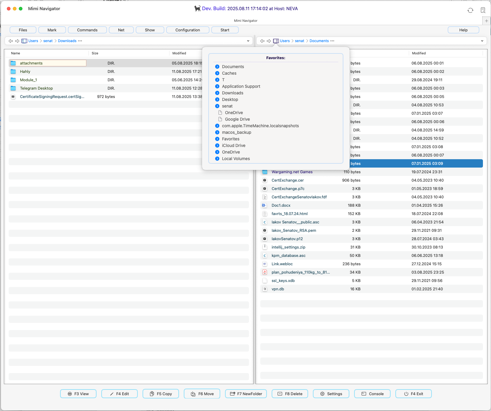

<div style="text-align: center;">
  
</div>

---
### MiMiNavigator - MacOS File manager with two panels
## (NOT READY YET, still under Development)


[](https://swift.org)
[](https://developer.apple.com/xcode/)
[](LICENSE)
[](https://www.apple.com/macos/)
[](https://developer.apple.com/xcode/swiftui/)
[](https://www.apple.com/mac-studio/)
[]()
[]()
[]()
[]()


---
##     Overview
MiMiNavigator is a macOS file manager built with Swift and SwiftUI.
The repository is organized around an Xcode project with sources under `MiMiNavigator/` and basic tests in `MiMiNavigatorTests` and `MiMiNavigatorUITests`.

<div style="text-align: center;" >
  
</div>


---
### General structure

Key directories inside `MiMiNavigator/`:

- **App** entry point and logging setup. The application reads a `.version` file, sets up a shared model container, and displays a main split view UI with a log viewer button. The code uses SwiftyBeaver for logging.

- **States** observable classes and actors that hold runtime state. `AppState` tracks the current directories and selected files, while `DualDirectoryScanner` scans both panels using timers and async updates.

- **Models** data structures such as `CustomFile`, an entity representing files or directories, and `FileSingleton`, an actor maintaining left/right file lists for SwiftUI updates.

- **Views** SwiftUI views for file panels, the top menu bar, and toolbar. `TotalCommanderResizableView` composes the main UI with a draggable divider and toolbar buttons for actions like view, edit, copy, and delete.

- **BreadCrumbNav** editable path controls and breadcrumb navigation.

- **Favorite** scans frequently used directories and mounted volumes to show a favorites tree.

- **Menus** menu item models and top menu rendering.

Other resources include asset catalogs, entitlements files, and a `refreshVersionFile.zsh` script that updates the `Gui/curr_version.asc` string.


---
### Important aspects

- **Concurrency** Directory scanning and file updates are handled by actors (`DualDirectoryScanner`, `FileSingleton`) and async tasks to keep the UI responsive.

- **User preferences** Window sizes, panel widths, and other state are stored using `UserPreferences`(UserDefaults wrappers).

- **Logging** `LogMan` sets up **SwiftyBeaver** console and file logging with custom icons for log levels.

- **Customization** Many UI components (menu buttons, path control, tooltip) are implemented as reusable **SwiftUI** views.

---
### Getting started

1. Clone the repository and open `MiMiNavigator.xcodeproj` in Xcode.

2. Build and run. The README outlines basic installation steps and features such as dual panel navigation and periodic directory scanning.

3. The main entry point is `MiMiNavigatorApp` which initializes logging and sets up the main view hierarchy. Explore `AppState` and `DualDirectoryScanner` to understand how directory changes propagate to the UI.

---
### Learning pointers

- **SwiftUI layout and modifiers** Many views use custom modifiers and gestures (e.g., `onHover`, drag gestures for the divider).

- **Actors and concurrency** `DualDirectoryScanner` demonstrates using timers inside an actor for periodic work.

- **AppKit interop** Some components rely on `NSWorkspace`, `NSAlert`, and other AppKit APIs for macOS 16.4 specific functionality.

- **Persistent data** The app uses SwiftData `ModelContainer` for future persistence, though currently the `Item`model is minimal.

This project is still under active development ( NOT READY YET  per the README) but provides a clear example of a SwiftUI macOS application with multithreading, logging, and modular UI components.

---
## Current Stage

-  Support for macOS 26 with Swift 6.2 beta5.
-  Periodic directory scanning and updating, using dynamic collections for real-time content refresh.
-  Modular and reusable components for top navigation.
-  Integrated file management actions including copy, rename, and delete.
-  Full Total Commander submenu structure recreated.
-  Dynamic output naming in shell utilities.
-  Dual-panel interface for managing files and directories.
-  Automatic UI updates when directory contents change.


---
## Requirements

- macOS 26 or later
- Swift 6.2
- Xcode 16.4 beta or later (recommended version: 26) *


---
##  Installation

1. Clone the repository:
    ```sh
    git clone https://github.com/username/MiMiNavigator.git
    cd MiMiNavigator
    ```
2. Open the project in Xcode:
    ```sh
    open MiMiNavigator.xcodeproj
    ```
3. Build and Run through Xcode or with the command:
    ```sh
    xcodebuild -scheme MiMiNavigator -configuration Debug CODE_SIGNING_ALLOWED=YES
    ```
4. Check sources
    ```sh
    periphery scan --project MiMiNavigator.xcodeproj --schemes MiMiNavigator
    ```


---
 ## Usage

1. Launching: Open the application and set directories for dual-panel mode.
2. File Operations:
    - Copy: Use the `Copy` option in the context menu for quick file duplication.
    - Rename: Select `Rename` and specify the new name.
    - Delete: Use `Delete` to move the file to the trash.
3. Automatic Updates: The application will periodically scan the specified directories and refresh content in real time.


---
## Authors

- Iakov Senatov:  [](https://www.linkedin.com/in/iakov-senatov-07060765)

| Step                | Description                                                                                    |
| ------------------- | ---------------------------------------------------------------------------------------------- |
| Installation        | Clone the repository, navigate to the project directory, and install dependencies as required. |
| Running the Project | Use the command `swift run` to launch the project.                                             |
| Usage               | Access features like configuration, file management, network, and tools from the main menu.    |


---
## FAQ

| Question                             | Answer                                                                   |
| ------------------------------------ | ------------------------------------------------------------------------ |
| How to configure settings?           | Navigate to Configuration to access display, layout, and color settings. |
| How to compare directories?          | Use the Files menu to compare and sync directories.                      |
| Can I rename multiple files at once? | Yes, use the Multi-Rename Tool available under Tools.                    |
| Is FTP supported?                    | Yes, FTP connection tools are available under the Network menu.          |
| Clean the Project from artefacts     | periphery scan --config .periphery.yml                                   |


---
## Recent Changes
```sh
* 93c8d12 - Senatov  (HEAD -> master) save temporarily / buffer (2 minutes ago, 2025-08-22 15:12:03 +0200)
* cb19ebd - Senatov  (origin/master, origin/HEAD) move selection on file panels. Under work (9 days ago, 2025-08-14 03:06:31 +0200)
* a6c6221 - Senatov  .cannot select right ! (9 days ago, 2025-08-13 21:11:54 +0200)
* a8f3f2a - Senatov  .fix selection (9 days ago, 2025-08-13 20:40:50 +0200)
* c1e4350 - Senatov  fix logs + refactoring (9 days ago, 2025-08-13 16:25:03 +0200)
* 64732f0 - Senatov  versioning (11 days ago, 2025-08-12 03:33:06 +0200)
* 11cd09f - Senatov  screenshot new (11 days ago, 2025-08-12 03:15:57 +0200)
* 5551c06 - Senatov  new time stamp (11 days ago, 2025-08-12 03:11:40 +0200)
* cf85e07 - Senatov  time marker (11 days ago, 2025-08-12 03:09:36 +0200)
* 315006c - Senatov  fix select file style (11 days ago, 2025-08-12 03:01:36 +0200)
* 2bd2ca4 - Senatov  Update README.md (11 days ago, 2025-08-11 17:25:06 +0200)
* 0275db5 - Senatov  fix security attr. (11 days ago, 2025-08-11 17:21:58 +0200)
* b0142f5 - Senatov  add some features (11 days ago, 2025-08-11 16:15:15 +0200)
* ffc2de3 - Senatov  save prev (11 days ago, 2025-08-11 12:45:01 +0200)
* 914a1be - Senatov  fix save/loas user's preferences (12 days ago, 2025-08-10 22:57:37 +0200)
* 974d90e - Senatov  clean on 'periphery scan --project MiMiNavigator.xcodeproj --schemes MiMiNavigator' (12 days ago, 2025-08-10 22:35:36 +0200)
* ac0c4bb - Senatov  fix String (12 days ago, 2025-08-10 22:14:13 +0200)
* 7e6c73b - Senatov  remove obsolete configs (12 days ago, 2025-08-10 19:52:23 +0200)
* ee66113 - Senatov  Update README.md (2 weeks ago, 2025-08-07 12:15:07 +0200)
* a24a585 - Senatov  remove Derived/ (2 weeks ago, 2025-08-07 12:10:58 +0200)
* 24d85b2 - Senatov  Update .gitignore (2 weeks ago, 2025-08-07 12:09:01 +0200)
* 1756bd0 - Senatov  preview & logo fixed (2 weeks ago, 2025-08-07 12:05:28 +0200)
* 626f362 - Senatov  (origin/new_prj_structure) preview & logo fixed (2 weeks ago, 2025-08-07 11:59:42 +0200)
* 891e539 - Senatov  Update README.md (2 weeks ago, 2025-08-07 11:47:26 +0200)
* fee99fa - Senatov  preview & logo fixed (2 weeks ago, 2025-08-07 11:57:01 +0200)
* 1bfdc29 - Senatov  Update README.md (2 weeks ago, 2025-08-07 11:52:46 +0200)
* 7cc55a4 - Senatov  Update README.md (2 weeks ago, 2025-08-07 11:50:52 +0200)
* c9c4b6a - Senatov  Update README.md (2 weeks ago, 2025-08-07 11:49:03 +0200)
* a654aef - Senatov  Update README.md (2 weeks ago, 2025-08-07 11:47:26 +0200)
* 4b29a36 - Senatov  fix paths (2 weeks ago, 2025-08-07 11:42:32 +0200)
* 29c4690 - Senatov  some fixies (2 weeks ago, 2025-08-07 11:33:08 +0200)
* 06d8906 - Senatov  new project structure (2 weeks ago, 2025-08-07 11:05:07 +0200)
* 7e33650 - Senatov  new project structure (2 weeks ago, 2025-08-07 11:04:59 +0200)
* 8829a33 - Senatov  .error fixing (2 weeks ago, 2025-08-07 02:28:55 +0200)
* 4ddde6d - Senatov  the same (2 weeks ago, 2025-08-05 11:09:49 +0200)
* 7e8615a - Senatov  fix file selection balk (2 weeks ago, 2025-08-05 10:26:31 +0200)
* 519ee90 - Senatov  impl select history I (3 weeks ago, 2025-07-31 19:00:54 +0200)
* 6ccbde8 - Senatov  click on breadCrump - fixed (4 weeks ago, 2025-07-29 02:17:52 +0200)
* db3def8 - Senatov  update md (4 weeks ago, 2025-07-29 00:40:30 +0200)
* 1b7cc0a - Senatov  fix: recursion on path - on works (4 weeks ago, 2025-07-25 19:11:58 +0200)
* a433406 - Senatov  fixies: ver new (4 weeks ago, 2025-07-25 00:49:28 +0200)
* d2808d8 - Senatov  fixies: -- (4 weeks ago, 2025-07-25 00:46:37 +0200)
* 46b9ac5 - Senatov  fixies: next (4 weeks ago, 2025-07-25 00:42:55 +0200)
* 7564737 - Senatov  fixed AppState (4 weeks ago, 2025-07-24 17:24:23 +0200)
* 4614581 - Senatov  fixies: between (4 weeks ago, 2025-07-24 03:27:12 +0200)
* f5fe17f - Senatov  selectedSide next fixies (4 weeks ago, 2025-07-22 12:26:36 +0200)
* 4bd8706 - Senatov  path in panel and und crumb synchronised (4 weeks ago, 2025-07-22 12:03:37 +0200)
* 080c288 - Senatov  ver (4 weeks ago, 2025-07-22 09:54:04 +0200)
* bb0e963 - Senatov  shadows fixed (4 weeks ago, 2025-07-22 09:53:53 +0200)
* 9bcb6cd - Senatov  .new preview (5 weeks ago, 2025-07-21 23:52:16 +0200)
* 7cc4117 - Senatov  .ver (5 weeks ago, 2025-07-21 23:48:50 +0200)
* c132de5 - Senatov  .fix sides (not ready) (5 weeks ago, 2025-07-21 23:48:15 +0200)
* 781bbe6 - Senatov  .right & .left repaired. ok (5 weeks ago, 2025-07-21 17:29:53 +0200)
* 3087ed4 - Senatov  search on Error left an right (5 weeks ago, 2025-07-21 17:07:29 +0200)
* 6c5ed55 - Senatov  PrettyTooltip (5 weeks ago, 2025-07-21 13:41:22 +0200)
* 89a0d53 - Senatov  stage saved (5 weeks ago, 2025-07-21 01:08:37 +0200)
* d32baa8 - Senatov  clean after scan --project MiMiNavigator (5 weeks ago, 2025-07-20 19:12:34 +0200)
* f7d4092 - Senatov  EditablePathControlWrapper(selectedSide: currSide) / remove @Environment (5 weeks ago, 2025-07-20 12:18:13 +0200)
* 2e6e19a - Senatov  after periphery scan (5 weeks ago, 2025-07-20 01:09:55 +0200)


```


---
 ##  Related Links

- [(NOT READY YET, still under Development)](#not-ready-yet-under-development----)
- [Overview](#overview)
  - [General structure](#general-structure)
  - [Important aspects](#important-aspects)
  - [Getting started](#getting-started)
  - [Learning pointers](#learning-pointers)
- [Current Stage](#current-stage)
- [Requirements](#requirements)
- [Installation](#installation)
- [Usage](#usage)
- [Authors](#authors)
- [FAQ](#faq)
- [Recent Changes](#recent-changes)
- [Related Links](#related-links)
