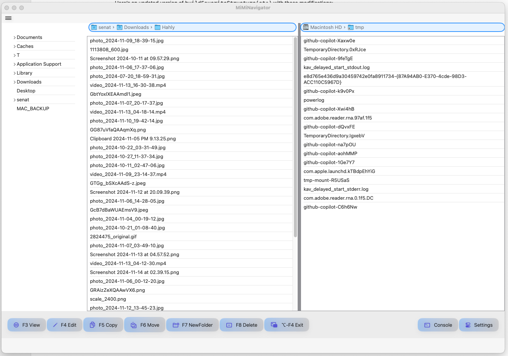

# 📁 MiMiNavigator - MacOS File manager with two panels
### (NOT READY YET, under development 🧹)

##


[](https://swift.org)
[](https://developer.apple.com/xcode/)
[](LICENSE)
[](https://www.apple.com/macos/)
[](https://developer.apple.com/xcode/swiftui/)
[](https://www.apple.com/mac-studio/)
[]()
[]()
[]()
[]()

## 📖 Overview
**MiMiNavigator** is a versatile navigation tool designed specifically for **macOS**. Built using **Swift** and **SwiftUI**, this project leverages the power of **Apple**'s ecosystem to provide a seamless experience. It includes advanced features that make full use of **multitasking** and **multithreading**, allowing efficient handling of directory monitoring, file operations, and user interactions.

This application highlights the strengths of **SwiftUI** in creating intuitive, responsive user interfaces and utilizes **multithreading** for efficient background processes, such as file scanning and updating views, ensuring that the application remains responsive even with intensive tasks.

**MiMiNavigator** is a versatile navigation tool that provides a Total Commander-style interface with directory tree navigation. This project is built with Swift 6, delivering high-performance, real-time file operations.


## ✨ Features



- Dual-panel interface for managing files and directories.
- Periodic directory scanning and updating, using dynamic collections for real-time content refresh.
- Integrated file management actions including copy, rename, and delete.
- Automatic UI updates when directory contents change.


- **Xcode** 16.2beta2 beta or later
- **Swift** 6.1 or later
- **macOS** Sequoia 15.1.1 or later

## 🚀 Installation

1. **Clone the repository:**
   ```bash
   git clone https://github.com/username/MiMiNavigator.git
   cd MiMiNavigator
   ```
2. **Open the project in Xcode:**
   ```bash
   open MiMiNavigator.xcodeproj
   ```
3. **Build and Run** through Xcode or with the command:
   ```bash
   xcodebuild -scheme MiMiNavigator -sdk macosx
   ```

## 📋 Usage

1. **Launching**: Open the application and set directories for dual-panel mode.
2. **File Operations**:
    - **Copy**: Use the `Copy` option in the context menu for quick file duplication.
    - **Rename**: Select `Rename` and specify the new name.
    - **Delete**: Use `Delete` to move the file to the trash.
3. **Automatic Updates**: The application will periodically scan the specified directories and refresh content in real time.

## 👤 Authors

- Iakov Senatov:
  [](https://www.linkedin.com/in/iakov-senatov-07060765)

| Step                   | Description                                                                                    |
|------------------------|------------------------------------------------------------------------------------------------|
| **Installation**       | Clone the repository, navigate to the project directory, and install dependencies as required. |
| **Running the Project** | Use the command `swift run` to launch the project.                                            |
| **Usage**              | Access features like configuration, file management, network, and tools from the main menu.    |

---

## 📅 Recent Changes

| Date and Time         | New Features                           | Description                                                                                                               |
|-----------------------|----------------------------------------|---------------------------------------------------------------------------------------------------------------------------|
| 2024-10-30 13:51:11   | Enhanced Asynchronous Access           | Added state properties for `leftFiles` and `rightFiles`, using async retrieval from `DualDirectoryMonitor` to avoid actor isolation conflicts. |
| 2024-10-30 10:55:55   | Dynamic "Favorites" Panel Data         | Added dynamic data loading in the "Favorites" panel.                                                                      |
| 2024-10-30 10:55:55   | Modular Structure                      | Reorganized code into smaller, modular Swift files in their respective directories.                                       |
| 2024-10-30 10:55:55   | Enhanced TotalCommanderResizableView   | Configured dynamic content display and refined view handling for better usability.                                        |
| 2024-10-31 12:00:00   | Improved Accessibility                 | Adjusted protection level and added public access method for favorite items.                                              |
| 2024-10-31 12:00:00   | Refined Logging                        | Enhanced logging for start/stop monitoring in TotalCommanderResizableView.                                                |
| 2024-10-31 12:00:00   | Organized README                       | Updated and clarified recent changes in the README for improved tracking.                                                 |
| 2024-11-01 18:15:00   | FileManagerState Singleton             | Added `FileManagerState` singleton class to manage `leftFiles` and `rightFiles` arrays across the app. Updated `DualDirectoryMonitor` to use `FileManagerState` and added a delegate pattern to notify changes in file arrays. |
| 2024-11-02 10:30:00   | New Logging Configuration              | Updated `SwiftyBeaver` configuration for color-coded log messages by level using emoji arrows.                            |
| 2024-11-02 14:00:00   | Refactored README Format               | Corrected Markdown formatting for tables in README for better GitHub rendering.                                           |
| 2024-11-04 14:00:00   | code                                   | Files area and favorites area are vieable
| 2024-11-04 14:00:00   | multithread refresh                    | Multithread reafresh of both file's lists Views depends on FS changes
---

## ❓ FAQ

| Question                                        | Answer                                                                                     |
|-------------------------------------------------|--------------------------------------------------------------------------------------------|
| **How to configure settings?**                  | Navigate to **Configuration** to access display, layout, and color settings.               |
| **How to compare directories?**                 | Use the **Files** menu to compare and sync directories.                                    |
| **Can I rename multiple files at once?**        | Yes, use the **Multi-Rename Tool** available under **Tools**.                              |
| **Is FTP supported?**                           | Yes, FTP connection tools are available under the **Network** menu.                        |

---

## 🔗 Related Links

- [Installation Guide](#quick-start-guide)
- [Features and Options](#features-and-options)
- [Recent Changes](#recent-changes)
- [FAQ](#faq)
  | Date & Time       | Description of Changes |
  |-------------------|------------------------|
  | 2024-11-01 18:15    | Added `FileManagerState` singleton class to manage `leftFiles` and `rightFiles` arrays across the app. Updated `DualDirectoryMonitor` to use `FileManagerState` and added a delegate pattern to notify changes in file arrays. |

## Recent Changes

- Added automatic start for `DualDirectoryScanner` with a 1-second interval for directory scanning.
- Modified the initializer in `DualDirectoryScanner` to handle actor isolation in Swift 6.1 by using `Task { await startMonitoring() }`.