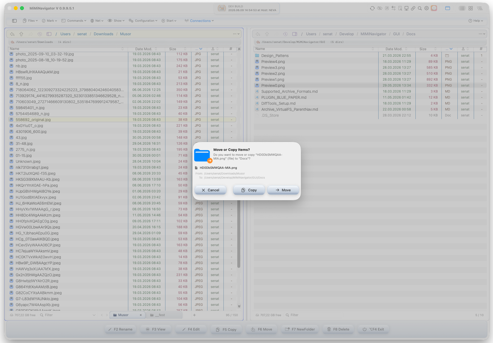
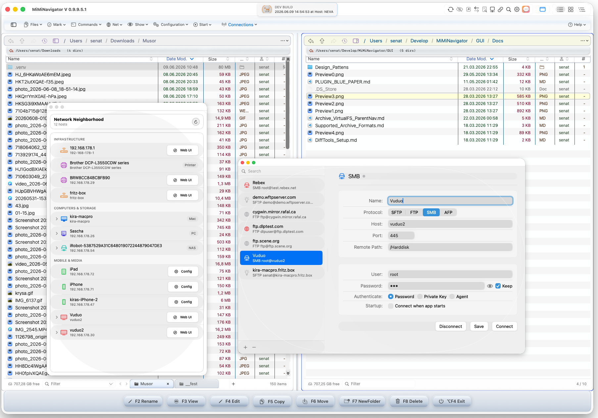
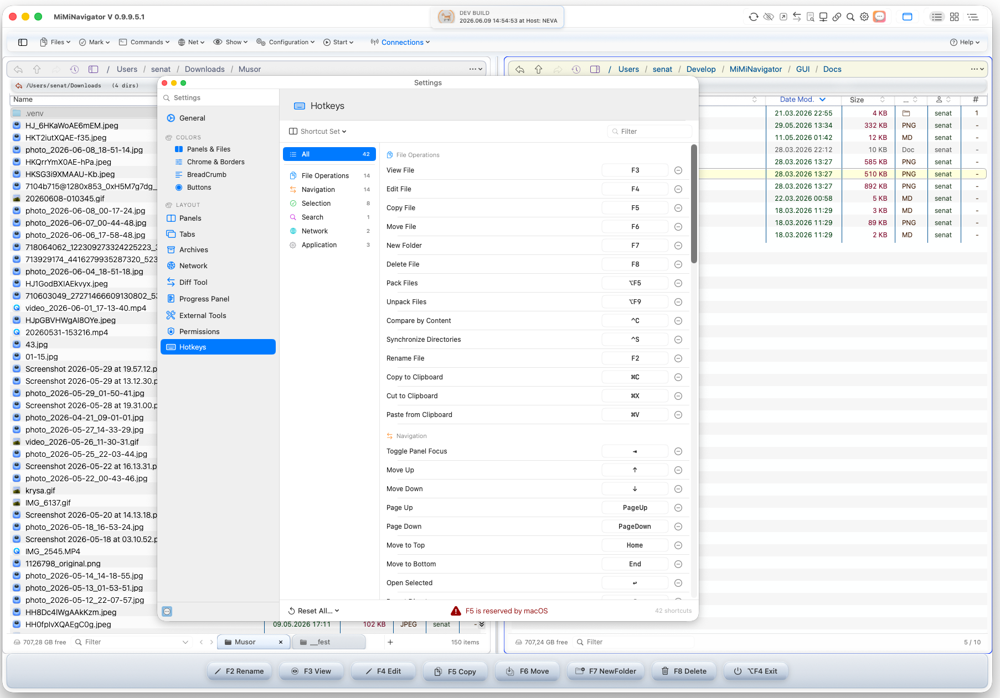
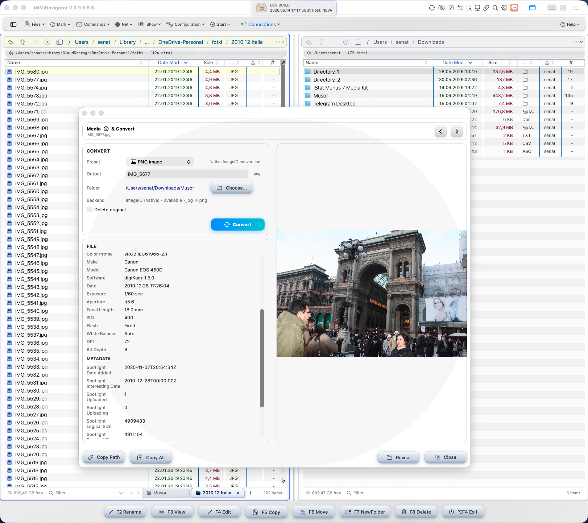

<h1 align="center">
  <br>
  
  <br>
  MiMiNavigator
  <br>
</h1>

<h4 align="center">A modern dual-panel file manager for macOS, built with SwiftUI</h4>

<p align="center">
  
  
  
  
  
  
</p>

<p align="center">
  <a href="#features">Features</a> ·
  <a href="#screenshots">Screenshots</a> ·
  <a href="#getting-started">Getting Started</a> ·
  <a href="#architecture">Architecture</a> ·
  <a href="#archive-support">Archive Support</a> ·
  <a href="#roadmap">Roadmap</a>
</p>

---

> **⚠️ Under active development.** APIs and UI may change without notice.

## What is MiMiNavigator?

MiMiNavigator is a dual-panel file manager inspired by **Total Commander** and **Norton Commander**, reimagined with native macOS technologies. It combines the efficiency of classic two-panel navigation with modern SwiftUI, Swift concurrency (actors, async/await), and macOS 26 liquid-glass design language.

**Why another file manager?**
- Finder lacks dual-panel workflow → MiMiNavigator gives you two panels side by side
- Total Commander doesn't exist on macOS → MiMiNavigator brings TC-style menus and hotkeys
- Built as a SwiftUI showcase → clean architecture, strict concurrency, modular packages

---

## Screenshots

<table>
  <tr>
    <td></td>
  </tr>
  <tr>
    <td align="center"><em>Preview</em></td>
  </tr>
</table>


<table>
  <tr>
    <td></td>
  </tr>
  <tr>
    <td align="center"><em>History</em></td>
  </tr>
</table>


<table>
  <tr>
    <td></td>
  </tr>
  <tr>
    <td align="center"><em>History</em></td>
  </tr>
</table>


<table>
  <tr>
    <td></td>
  </tr>
  <tr>
    <td align="center"><em>History</em></td>
  </tr>
</table>


---

## Features

### Core

| Feature | Description |
|---------|-------------|
| **Dual Panels** | Two independent file panels with synchronized operations |
| **Tabbed Interface** | Multiple tabs per panel (⌘T open, ⌘W close, ⌘⇧]/[ switch); tab context menu; persistence between launches |
| **List & Thumbnail Views** | Toggle per panel via toolbar; thumbnail size 16–900 pt via inline status-bar slider |
| **Finder-Style Table** | Sortable columns: Name, Size, Date, Permissions, Owner, Type |
| **Multi-Selection** | Cmd+Click toggle, Shift+Click range, Insert mark+next, pattern matching, Ctrl+A |
| **Group Operations** | Batch Cut/Copy/Compress/Share/Delete on marked files; group context menu |
| **Multi-File Drag & Drop** | Drag all marked files together; badge preview with count; Finder-compatible; works in both list and thumbnail views |
| **Open With** | Per-extension LRU (max 5) — recently used apps float to top; "Other..." picks persisted and restored |
| **Find Files** | Advanced search: by name (wildcards), content, size, date — with archive search |
| **Archive VFS** | Open archives as virtual directories, navigate inside, auto-repack on exit |
| **Parent Directory** | `...` entry pinned to top of every panel, archive-aware navigation |
| **Navigation History** | Per-panel history with quick-jump popover |
| **Breadcrumb Nav** | Click-to-navigate path bar |
| **Favorites Sidebar** | Quick access to bookmarked locations (FavoritesKit package) |
| **Real-time Updates** | Automatic refresh on file system changes |
| **FTP/SFTP** | Remote file browsing via curl (FTP) and Citadel/NIOSSH (SFTP) |
| **Network Neighborhood** | SMB/AFP share discovery, mounting, and browsing across LAN |
| **Connect to Server** | Saved server bookmarks with keychain passwords, session reuse, disconnect |

### Keyboard Shortcuts

| Key | Action | Key | Action |
|-----|--------|-----|--------|
| `↑` `↓` | Navigate | `Tab` | Switch panels |
| `Enter` | Open | `⌘R` | Refresh |
| `F5` | Copy to other panel | `⌘.` | Toggle hidden files |
| `⌘O` | Open / Get Info | `⌘T` | New Tab |
| `⌘W` | Close Tab | `⌘⇧]`/`⌘⇧[` | Next/Prev Tab |
| `Cmd+Click` | Toggle file mark | `Shift+Click` | Range select |
| `Insert` | Toggle mark + next | `Ctrl+A` | Mark all files |
| `Num+` | Mark by pattern | `Num-` | Unmark by pattern |
| `Num*` | Invert marks | `⌘⌫` | Delete marked/selected |

### TC-Style Menu System

Eight menu categories matching Total Commander conventions: **Files** (F6 Rename, Pack/Unpack, Compare) · **Mark** (Select/Deselect groups) · **Commands** (Terminal, CD Tree) · **Net** (FTP) · **Show** (View modes, Hidden files) · **Configuration** · **Start** (Tabs) · **Help**.

### UI & Design

- **macOS 26 Liquid-Glass** menu bar with ultra-thin material, gradient borders, and multi-layered shadows
- Pixel-perfect Retina rendering via `backingScaleFactor`
- Sticky column headers, zebra-striped rows, animated toolbar buttons
- Hidden files shown in bluish-gray, symlinks labeled as "Alias"

---

## Archive Support

MiMiNavigator can browse archives as virtual directories. Double-click opens the archive, `..` exits with automatic repacking if files were modified.

**50+ formats supported:**

| Category | Formats |
|----------|---------|
| Standard | `zip` `7z` `rar` `tar` |
| Compressed TAR | `tar.gz` `tar.bz2` `tar.xz` `tar.zst` `tar.lz4` `tar.lzo` `tar.lz` `tar.lzma` |
| Packages | `deb` `rpm` `cab` `cpio` `xar` |
| macOS | `dmg` `pkg` |
| Java/Android | `jar` `war` `ear` `aar` `apk` |
| Disk Images | `iso` `img` `vhd` `vmdk` |
| Legacy | `arj` `lha` `lzh` `ace` `sit` `sitx` `Z` |

**Extraction chain:** `/usr/bin/unzip` → `/usr/bin/tar` (libarchive) → `7z` (fallback). Install 7z for full format support: `brew install p7zip`.

---

## Getting Started

### ⚠️ Download & Run (Pre-Built Binary)

> **The app is not notarized.** macOS Gatekeeper will block it on first launch.
> You **must** run this command after downloading:

```bash
xattr -cr ~/Downloads/MiMiNavigator.app
```

Then double-click `MiMiNavigator.app` as usual.

Alternatively: right-click the app → Open → click **Open** in the dialog.

**[Download latest release →](https://github.com/senatov/MiMiNavigator/releases/latest)**

---

### Build from Source
**Requirements:**
- macOS 26+ (Apple Silicon)
- Xcode (latest) with Swift 6.2
- Optional: `brew install swiftlint swift-format p7zip`

**Production Build:**
```
~/Develop/MiMiNavigator [master*]  xcodebuild -project MiMiNavigator.xcodeproj -scheme MiMiNavigator -configuration Release -derivedDataPath /tmp/mimi_build build CODE_SIGNING_ALLOWED=YES
```
Then get copy the App from
```
/private/tmp/mimi_build/Build/Products/Release
```


```bash
git clone --recurse-submodules https://github.com/senatov/MiMiNavigator.git
cd MiMiNavigator
open MiMiNavigator.xcodeproj
# ⌘R to build and run
```

Or via command line:

```bash
xcodebuild -scheme MiMiNavigator -configuration Debug \
  -destination 'platform=macOS' CODE_SIGNING_ALLOWED=NO build
```

---

## Architecture

```
MiMiNavigator/
├── Gui/Sources/
│   ├── App/                # Entry point, AppLogger, toolbar
│   ├── AppDelegates/       # NSApplicationDelegate
│   ├── States/
│   │   ├── AppState/       # AppState (@Observable), SelectionManager,
│   │   │                   # MultiSelectionManager, StatePersistence,
│   │   │                   # FileListSnapshot, FileSortingService
│   │   ├── Commands/       # AppCommands (menu bindings)
│   │   └── History/        # PanelNavigationHistory, SelectionsHistory,
│   │                       # HistoryEntry, FileSnapshot
│   ├── Features/
│   │   ├── Tabs/           # TabItem, TabManager, TabBarView, TabItemView,
│   │   │                   # TabContextMenu
│   │   ├── Panels/         # FilePanelView, FileRow, FileRowView,
│   │   │   │               # FileTableRowsView, SelectionStatusBar,
│   │   │   │               # AliasIconComposer, PanelDividerView
│   │   │   ├── FileTable/  # FileTableView (+Actions, +State),
│   │   │   │               # TableHeaderView, TableKeyboardNavigation,
│   │   │   │               # ColumnLayoutModel, ResizableDivider
│   │   │   └── Filter/     # PanelFilterBar, PanelFilterHistory
│   │   ├── Network/        # NetworkNeighborhoodView, NetworkHost,
│   │   │                   # NetworkMountService, NetworkDeviceFingerprinter,
│   │   │                   # FritzBoxDiscovery, WebUIProber
│   │   └── ConnectToServer/# ConnectToServerView, RemoteFileProvider,
│   │                       # RemoteConnectionManager, RemoteServerStore
│   ├── ContextMenu/
│   │   ├── ActionsEnums/   # FileAction, DirectoryAction, MultiSelectionAction,
│   │   │                   # PanelBackgroundAction
│   │   ├── Menus/          # FileContextMenu, DirectoryContextMenu,
│   │   │                   # MultiSelectionContextMenu, OpenWithSubmenu
│   │   ├── Dialogs/        # ConfirmationDialog, RenameDialog, PackDialog,
│   │   │   │               # BatchConfirmation/Progress, CreateLinkDialog
│   │   │   └── FileConflict/  # FileConflictDialog, ConflictResolution
│   │   └── Services/       # ContextMenuCoordinator, ClipboardManager,
│   │       │               # CompressService, QuickLookService
│   │       ├── Coordinator/   # FileActionsHandler, DirectoryActionsHandler,
│   │       │                  # MultiSelectionActionsHandler, ActiveDialog
│   │       └── FileOperations/ # BatchOperationCoordinator, FileOperationsService,
│   │                          # DirectorySizeCalculator, UniqueNameGenerator
│   ├── Services/
│   │   ├── Archive/        # ArchiveManager (actor), ArchiveExtractor,
│   │   │                   # ArchiveRepacker, ArchiveFormatDetector,
│   │   │                   # ArchiveNavigationState, ArchivePasswordStore
│   │   ├── Scanner/        # DualDirectoryScanner (actor), FileScanner,
│   │   │                   # FSEventsDirectoryWatcher
│   │   ├── FileOperations/ # BasicFileOperations, FileDialogs, VSCodeIntegration
│   │   └── Diagnostics/    # SpinnerWatchdog
│   ├── FindFiles/          # FindFilesViewModel, FindFilesCoordinator,
│   │   │                   # FindFilesWindowContent, SearchHistoryManager
│   │   └── Engine/         # FindFilesEngine (actor), FindFilesNameMatcher,
│   │                       # FindFilesContentSearcher, FindFilesArchiveSearcher,
│   │                       # NativeZipReader, FindFilesResultBuffer
│   ├── DragDrop/           # DragDropManager, DragPreviewView,
│   │                       # FileTransferConfirmationDialog
│   ├── Menus/              # TC-style glass menu bar, MenuCategory, MenuItem
│   ├── BreadCrumbNav/      # BreadCrumbView, PathAutoCompleteField
│   ├── HotKeys/            # HotKeyStore, HotKeySettingsView, HotKeyRecorderView,
│   │                       # ShortcutConflictValidator
│   ├── History/            # HistoryRow, HistoryWindowContent
│   ├── Favorites/          # FavoritesNavigationAdapter, BookmarkStore
│   ├── Settings/           # SettingsWindowView, SettingsColorsPane,
│   │                       # DiffToolRegistry, SettingsPermissionsPane
│   ├── SplitLine/          # OrangeSplitView, SplitContainer, DividerAppearance
│   ├── Toolbar/            # ToolbarStore, ToolbarCustomizeView
│   ├── Config/             # DesignTokens, UserPreferences, AppConstants,
│   │                       # InterfaceScaleStore, PreferenceKeys
│   └── Localization/       # L10n.swift
├── Packages/               # git submodule → github.com/senatov/MiMiKits (private)
│   ├── ArchiveKit/         # Archive format support module
│   ├── FavoritesKit/       # Reusable favorites module (.dylib)
│   ├── FileModelKit/       # CustomFile model and utilities
│   ├── LogKit/             # Centralized logging (SwiftyBeaver)
│   ├── NetworkKit/         # Network neighborhood discovery (SMB/AFP)
│   └── ScannerKit/         # File scanning utilities
└── Gui/Docs/               # Architecture docs, screenshots
```

### Key Patterns

| Pattern | Usage |
|---------|-------|
| `@Observable` + `@MainActor` | `AppState` — global app state, panels, archive states |
| `@Observable` + `@MainActor` | `MultiSelectionManager` — Cmd/Shift click, Insert mark, pattern match |
| `@Observable` + `@MainActor` | `TabManager` — per-panel tab collection, persistence, navigation |
| `@Observable` + `@MainActor` | `ContextMenuCoordinator` — singleton handling all context menu actions |
| `actor` | `DualDirectoryScanner` — thread-safe file scanning |
| `actor` | `ArchiveManager` — session lifecycle, dirty tracking, extraction, repacking |
| `AsyncStream` | `FindFilesEngine` — streaming search results with cancellation |
| `filesForOperation()` | Unified API: returns marked files if any, single selected file otherwise |
| `NSEvent.modifierFlags` | Detecting Cmd/Shift during SwiftUI gesture handlers |
| Security-Scoped Bookmarks | Persistent file access in sandboxed mode |
| Swift Package (dynamic) | `FavoritesKit` — extracted as reusable `.dylib` |

### Logging

Uses **SwiftyBeaver** with tags: `[FindEngine]` `[ArchiveSearcher]` `[Extractor]` `[Repacker]` `[FormatDetector]` `[SELECT-FLOW]` `[NAV]` `[DOUBLE-CLICK]`

Log file: `~/Library/Application Support/MiMiNavigator/Logs/MiMiNavigator.log`

---

## Roadmap

### Done ✅

- [x] Dual-panel navigation with breadcrumbs
- [x] Finder-style sortable table (Name, Size, Date, Permissions, Owner)
- [x] Drag & drop with HIG confirmation
- [x] TC-style menu system (8 categories)
- [x] macOS 26 liquid-glass UI
- [x] Navigation history per panel
- [x] File copy (F5), Open/Get Info (⌘O)
- [x] Hidden files toggle with persistence
- [x] Security-scoped bookmarks
- [x] FavoritesKit Swift Package
- [x] Archive virtual filesystem (50+ formats)
- [x] Find Files with archive search
- [x] Parent directory navigation (`..`)
- [x] Multi-selection: Cmd+Click, Shift+Click, Insert, pattern matching, Ctrl+A
- [x] Group context menu with batch operations
- [x] Multi-file drag & drop with badge preview (list and thumbnail modes)
- [x] Batch-aware file actions (Cut/Copy/Delete/Compress/Share on marked files)
- [x] Total Commander style marking: dark red, semibold, enlarged font
- [x] Selection status bar (marked count + total size + disk free space + inline slider)
- [x] Thumbnail grid view per panel (16–900 pt, QL thumbnails, context menu, drag-drop)
- [x] Open With LRU per file extension (max 5, "Other..." picks persisted)
- [x] Column width persistence
- [x] Hotkey customization
- [x] Tabbed interface (multiple tabs per panel, context menu, persistence)
- [x] Archive Open → TC-style virtual directory (not Finder/Archive Utility) NOT READY YET!

### In Progress 🚧

- [ ] Batch rename for marked files
- [ ] Terminal integration at current path
- [ ] Custom themes and color schemes

### Planned 🎯
- [ ] Three-panel layout option
- [x] FTP/SFTP connectivity (Citadel SFTP + curl-based FTP)
- [x] Network filesystem (SMB/AFP mount, Network Neighborhood discovery)
- [ ] Cloud storage (iCloud, Dropbox)
- [ ] Advanced file comparison
- [ ] Plugin system
- [ ] App Store release

---

## Contributing

Contributions welcome! MiMiNavigator is a real-world SwiftUI project with clean architecture, strict Swift 6.2 concurrency, and plenty of room to grow.

### Good First Issues

Looking for a way to start? Here are areas where help is especially appreciated:

| Area | Difficulty | Description |
|------|-----------|-------------|
| **Batch Rename** | ⭐⭐ | Rename multiple marked files with pattern (e.g. `Photo_{N}.jpg`) |
| **File Preview** | ⭐⭐ | Quick Look panel for selected file (QLPreviewPanel integration) |
| **Themes** | ⭐⭐ | Dark/light/custom color schemes with persistence |
| **Localization** | ⭐ | Translate UI strings (German and Russian already done) |
| **Unit Tests** | ⭐⭐ | Tests for MultiSelectionManager, FileOperations, ArchiveManager |
| **FTP/SFTP** | ⭐⭐⭐ | Remote file system panel via Network framework |
| **Performance** | ⭐⭐ | Profile and optimize for directories with 10k+ files |

### How to Contribute

1. Fork the repo and create a feature branch
2. Read [CONTRIBUTING.md](CONTRIBUTING.md) for code style and commit guidelines
3. Build and test locally (`⌘R` in Xcode)
4. Open a PR with a clear description and screenshots for UI changes

### Why Contribute?

- **Learn SwiftUI** on a real dual-panel file manager (not a todo app)
- **Swift 6.2 concurrency** — actors, async/await, `@Observable`, strict Sendable
- **macOS-native** development — NSWorkspace, security-scoped bookmarks, Quick Look, AppleScript
- **Clean architecture** — modular structure, no file over 400 lines, extensive logging
- Friendly maintainer who reviews PRs quickly

> I openly acknowledge using AI assistants for architecture discussions and code review. This README was crafted with care for both humans and crawlers.

---


---

## Third-Party Libraries

MiMiNavigator uses the following open-source libraries. We are grateful to their authors.

### SwiftyBeaver -- Structured Logging
- **Author:** Sebastian Kreutzberger and contributors
- **License:** MIT
- **Repository:** https://github.com/SwiftyBeaver/SwiftyBeaver
- **Usage in project:** All application logging -- console output and persistent log file at `~/Library/Logs/MiMiNavigator.log`. Bootstrapped in `LogKit` package, re-exported as global `log` across all source files so every module can use `log.debug / log.info / log.error` without additional imports.

### Citadel -- SSH / SFTP Client
- **Author:** Joannis Orlandos (Orlandos BV) and contributors
- **License:** MIT
- **Repository:** https://github.com/orlandos-nl/Citadel
- **Usage in project:** `SFTPFileProvider` -- full SFTP connectivity in the Connect to Server feature. Provides `SSHClient`, `SFTPClient`, and OpenSSH private-key parsing. Replaces what would otherwise require spawning ssh/sftp CLI processes or linking against libssh2.

---

## Where Open-Source Libraries Could Further Help

Several areas in MiMiNavigator use custom implementations that could be simplified or replaced by existing open-source libraries.

### 1. Archive handling -- ZIPFoundation

**Files:** `NativeZipReader.swift` (~350 lines), ZIP branch of `FindFilesArchiveSearcher.swift`

**Current approach:** Custom binary ZIP central-directory parser + `Process()` wrappers around `/usr/bin/unzip`, `/usr/bin/tar`, `7z`.

**Candidate:** [ZIPFoundation](https://github.com/weichsel/ZIPFoundation) (MIT, Thomas Zoechling)
- Pure Swift, no `Process()` spawning for ZIP/GZIP
- Streaming extraction, password-protected archives, in-memory entries
- Would eliminate `NativeZipReader` and its error-prone manual byte-offset arithmetic
- TAR/7z/RAR still require CLI fallback (no pure-Swift lib covers all 50+ formats)

### 2. FTP file listing -- curl

**File:** `FTPFileProvider.swift` -- `parseFTPListing()` method

**Current approach:** URLSession FTP + hand-written Unix-style `LIST` output parser. Fragile: breaks on IIS FTP, DOS-style listings, localized dates. URLSession FTP is deprecated by Apple.

**Candidate:** `curl` via `Process()` -- already present on every Mac
- `curl -l ftp://host/path` gives clean filename-per-line output, no parsing needed
- `curl --ftp-ssl` adds FTPS for free
- Handles MLSD, active/passive mode, AUTH TLS automatically

### 3. Network device fingerprinting -- nmap

**Files:** `NetworkDeviceFingerprinter.swift` (~200 lines), `WebUIProber.swift`

**Current approach:** Custom async TCP port prober via POSIX `connect()`, checks 20+ ports per host in parallel, classifies device type by open-port combination.

**Candidate:** [nmap](https://nmap.org) (GPLv2) via `Process()`
- Already used manually during development for Vuduo2 diagnostics -- proven reliable
- `nmap -sV --open -p <ports> <host>` returns service names in machine-parseable format
- Would eliminate ~200 lines of custom probing logic
- **Caveat:** requires `brew install nmap`; must remain optional with graceful fallback

### 4. SSH private-key auth -- Citadel (already resolved)

**Status:** Resolved -- Citadel (already a SPM dependency) provides `Insecure.RSA.PrivateKey(sshRsa:)` and `Curve25519.Signing.PrivateKey` for OpenSSH private key parsing.

### 5. Glob / wildcard matching (low priority -- current code is adequate)

**File:** `FindFilesNameMatcher.swift` -- ~30-line wildcard-to-regex converter. Works correctly for current feature set; worth revisiting only if `{a,b}` alternation or `**` recursive matching is needed.

---

## Acknowledgements

**MiMiNavigator** is developed by **Iakov Senatov** -- Diplom-Ingenieur (Chemical Process Engineering), 35 years of programming experience.

Sincere thanks to the open-source community:

| Author | Project | Why it matters |
|--------|---------|----------------|
| Sebastian Kreutzberger | [SwiftyBeaver](https://github.com/SwiftyBeaver/SwiftyBeaver) | Clean, fast, zero-ceremony logging that just works |
| Joannis Orlandos | [Citadel](https://github.com/orlandos-nl/Citadel) | Excellent SSH/SFTP library, bridges the gap SwiftNIO SSH leaves open |
| Thomas Zoechling | [ZIPFoundation](https://github.com/weichsel/ZIPFoundation) | Model of clean Swift API design, earmarked for adoption |
| The nmap Project | [nmap](https://nmap.org) | Gold standard in network diagnostics, invaluable during LAN discovery development |
| Apple | SwiftNIO, SwiftUI, kqueue, NetServiceBrowser | Making macOS-native development a genuine pleasure |

Special thanks to **Anthropic / Claude** for pair-programming throughout this project -- architecture decisions, refactoring, debugging, and documentation.


## License

[AGPL-3.0](LICENSE) — Iakov Senatov

<p align="center">
  <a href="https://www.linkedin.com/in/iakov-senatov-07060765"></a>
  <a href="https://github.com/senatov"></a>
</p>

<p align="center"><sub>Made with ❤️ for macOS · Building the future of file management, one commit at a time</sub></p>