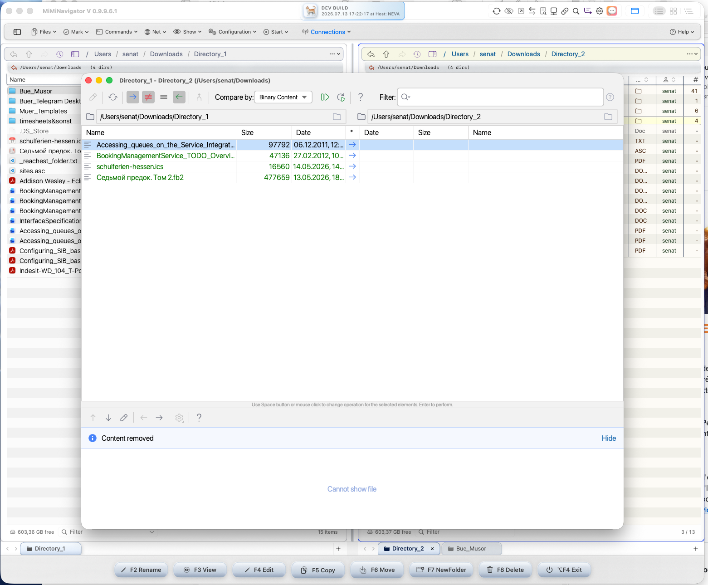
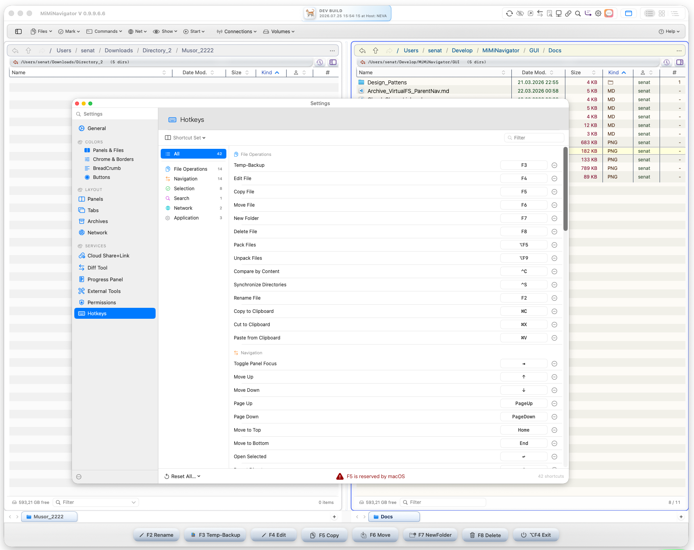
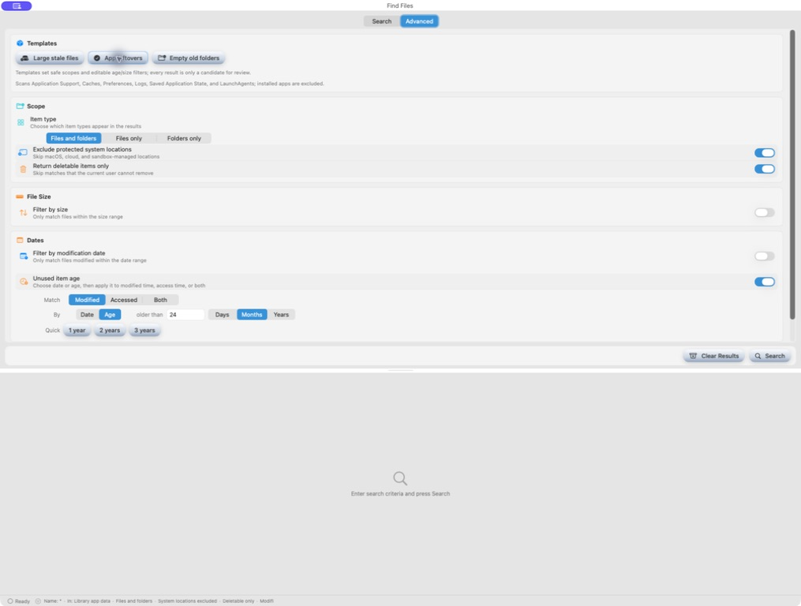
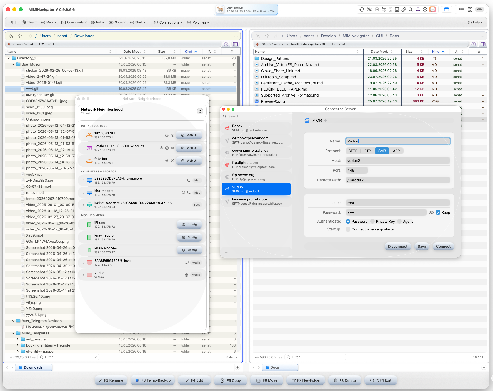

<h1 align="center">
  <br>
  
  <br>
  MiMiNavigator
  <br>
</h1>

<h4 align="center">A native dual-panel file manager for macOS 26+</h4>

<p align="center">
  
  
  
  <a href="https://github.com/senatov/MiMiNavigator/releases/tag/v0.9.9.7.2"></a>
</p>

<p align="center">
  <a href="#what-it-does">What it does</a> ·
  <a href="#screenshots">Screenshots</a> ·
  <a href="#install">Install</a> ·
  <a href="#comparison-and-synchronization">Compare &amp; sync</a> ·
  <a href="#build-from-source">Build</a> ·
  <a href="CHANGELOG.md">Changelog</a>
</p>

---

MiMiNavigator brings the practical two-panel workflow of Total Commander and Norton Commander to macOS. It keeps the source and destination visible, remembers your tabs and views, and handles everyday file work without a pile of Finder windows.

It is free, open source, built with SwiftUI, signed, and notarized.

> **Under active development.** Features and interface details may still change.

## What it does

### Two-panel file work

Browse two locations side by side and copy, move, rename, organize, or inspect files with the keyboard or mouse. Tabs, paths, history, selections, and List, Preview, or Tree views remain available between sessions.

### Find and clean safely

Search by name, content, size, or date, including inside archives. Focused presets help find large forgotten files, empty folders, and recognizable leftovers from removed applications. Results remain actionable, so several items can be reviewed and processed together.

**MiMiNavigator never permanently deletes files or directories.** Every removal goes only and exclusively to the macOS Trash, where it remains recoverable. What you do with those files afterwards—if you are paranoid or enemies are watching you—is none of MiMiNavigator's business.

### Batch rename and archives

Rename groups of files with masks, counters, replacements, case conversion, and a live conflict preview. Archives behave like virtual folders: browse them, search them, copy files in or out, and let MiMiNavigator repack modified archives when the session ends.

More than 50 formats are supported, including ZIP, RAR, 7Z, TAR, DMG, PKG, ISO, Java/Android packages, disk images, and legacy formats. ZIP and TAR-family archives use macOS tools; extended format support is available through `unar` and `p7zip`.

### Remote, cloud, and media

Open SFTP and FTP servers in a panel, discover SMB and AFP shares on the local network, and use cloud drives mounted by macOS or their provider applications. Google Drive and Dropbox can also publish selected items and create shareable links.

Media files can be previewed, inspected, and converted from the same workflow. Optional tools such as FFmpeg and gifski extend the available conversion formats.

## Comparison and synchronization

File comparison, directory comparison, and synchronization are large specialist tasks—not small checkboxes in a file manager. MiMiNavigator deliberately delegates them to mature, well-established applications instead of pretending to replace those tools.

Choose your preferred application in **Settings → Diff Tool**. MiMiNavigator can hand selected files or directories to tools such as:

- [KDiff3](https://apps.kde.org/kdiff3/) — recommended free option for files and directories
- [IntelliJ IDEA](https://www.jetbrains.com/help/idea/comparing-files-and-folders.html) — file and directory comparison
- FileMerge / `opendiff` — available with Xcode or Xcode Command Line Tools

The External Tool Doctor detects supported tools and explains what is missing. Synchronization can be connected to the specialized application you already know and trust.

## Screenshots

<table>
  <tr>
    <td></td>
  </tr>
  <tr>
    <td align="center"><em>Two-panel file management with persistent views</em></td>
  </tr>
</table>

<table>
  <tr>
    <td></td>
  </tr>
  <tr>
    <td align="center"><em>Find Files and focused cleanup presets</em></td>
  </tr>
</table>

<table>
  <tr>
    <td></td>
  </tr>
  <tr>
    <td align="center"><em>Customizable keyboard shortcuts and command groups</em></td>
  </tr>
</table>

<table>
  <tr>
    <td></td>
  </tr>
  <tr>
    <td align="center"><em>Network discovery and saved remote connections</em></td>
  </tr>
</table>

## Install

The current DMG is signed and notarized by Apple. No App Store account, subscription, or additional installer is required.

1. [Download MiMiNavigator v0.9.9.7.2](https://github.com/senatov/MiMiNavigator/releases/tag/v0.9.9.7.2).
2. Open the DMG and drag MiMiNavigator to Applications.
3. Launch it from Applications.

[Browse all releases](https://github.com/senatov/MiMiNavigator/releases)

## Optional external tools

Normal browsing and file operations work without extra software. Install only the capabilities you need:

| Purpose | Tool |
|---------|------|
| Extended archive formats | `brew install unar p7zip` |
| File and directory comparison | `brew install --cask kdiff3` |
| Video and audio conversion | `brew install ffmpeg` |
| High-quality animated GIF export | `brew install gifski` |
| Lottie and TGS conversion | `python3 -m pip install --user lottie` |

The project helper installs and refreshes the recommended set:

```zsh
zsh Scripts/update_external_tools.zsh
```

More detail is available in the focused documentation:

- [Diff tools setup](GUI/Docs/DiffTools_Setup.md)
- [Supported archive formats](GUI/Docs/Supported_Archive_Formats.md)
- [Cloud Share+Link](GUI/Docs/Cloud_Share_Link.md)
- [Archive virtual filesystem](GUI/Docs/Archive_VirtualFS_ParentNav.md)

## Cloud storage

Cloud drives mounted under `~/Library/CloudStorage` appear automatically. This includes iCloud Drive and desktop clients for Google Drive, Dropbox, OneDrive, Proton Drive, and other providers that expose a normal filesystem location. `rclone` mounts are available through `/Volumes`.

MiMiNavigator remains a filesystem browser. Its narrow Google Drive and Dropbox integrations publish selected items and create sharing links; the providers' own applications remain responsible for storage and synchronization.

## Keyboard workflow

MiMiNavigator supports familiar file-manager shortcuts, including `Tab` to change panels, `F5` to copy, `F6` to rename, `F7` to create a folder, `Insert` to mark and advance, and `⌘⌫` to send selected items to the Trash. Shortcuts can be changed in Settings.

## Build from source

Requirements:

- macOS 26+ on Apple Silicon
- Current Xcode with Swift 6.2
- Git submodules

```zsh
git clone --recurse-submodules https://github.com/senatov/MiMiNavigator.git
cd MiMiNavigator
zsh Scripts/stamp_version.zsh
open MiMiNavigator.xcodeproj
```

Press `⌘R` in Xcode, or build from the command line:

```zsh
zsh Scripts/stamp_version.zsh
xcodebuild -scheme MiMiNavigator -configuration Debug \
  -destination 'platform=macOS' CODE_SIGNING_ALLOWED=NO build
```

## Architecture

MiMiNavigator is a native SwiftUI application using Swift 6.2 strict concurrency. The code is organized around a small set of product areas:

```text
GUI/Sources/
├── App and state
├── Panels, tabs, navigation, and selection
├── File operations and context menus
├── Find Files and Multi-Rename
├── Archives and media tools
├── Remote servers, network, and cloud sharing
├── Settings, hotkeys, and external tools
└── Diagnostics and persistence

Packages/
├── ArchiveKit and CacheKit
├── FavoritesKit and RenameKit
├── FileModelKit and ScannerKit
└── LogKit and NetworkKit
```

Actors isolate scanning, archive sessions, search, and persistent cache work. Observable main-actor state drives the interface. GRDB/SQLite provides a bounded persistent cache for directory sizes and validated file hashes.

For implementation details, start with [CONTRIBUTING.md](CONTRIBUTING.md), the documents in [GUI/Docs](GUI/Docs), and the source-level `AGENTS.md` guidelines.

## Roadmap

MiMiNavigator is concentrating on file-manager work where a native two-panel interface adds real value:

- a persistent preview pane
- saved workspaces and a command bar
- Git status and improved Finder integration
- duplicate search and safer cleanup assistance
- direct WebDAV, S3, and B2 access
- CloudKit synchronization for non-secret application settings

Comparison and synchronization are intentionally not roadmap promises. They remain integrations with dedicated external tools configured through Settings.

## Contributing

Contributions are welcome. Fork the repository, read [CONTRIBUTING.md](CONTRIBUTING.md), build locally, and open a pull request with a clear description and screenshots for interface changes.

Useful contribution areas include tests, localization, performance, previews, themes, remote backends, and improvements to existing workflows. The full release history lives in [CHANGELOG.md](CHANGELOG.md), so this README stays focused on what the application is and how to use it.

## Credits

MiMiNavigator builds on excellent open-source and platform work, including SwiftyBeaver, Citadel, FFmpeg, gifski, p7zip, unar, SwiftNIO, SwiftUI, and macOS system frameworks. Their respective licenses apply; see the application bundle and project documentation for notices.

MiMiNavigator is developed by **Iakov Senatov** — Diplom-Ingenieur (Chemical Process Engineering), with 35 years of programming experience.

## License

[AGPL-3.0](LICENSE) — Iakov Senatov

<p align="center">
  <a href="https://www.linkedin.com/in/iakov-senatov-07060765"></a>
  <a href="https://github.com/senatov"></a>
</p>
