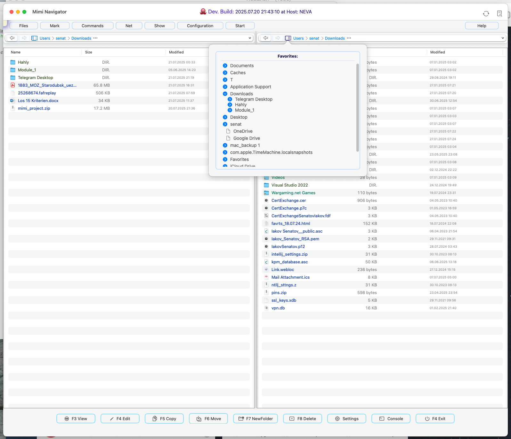

### MiMiNavigator - MacOS File manager with two panels
## (NOT READY YET, under development    )


[](https://swift.org)
[](https://developer.apple.com/xcode/)
[](LICENSE)
[](https://www.apple.com/macos/)
[](https://developer.apple.com/xcode/swiftui/)
[](https://www.apple.com/mac-studio/)
[]()
[]()
[]()
[]()


##     Overview
MiMiNavigator is a macOS file manager built with Swift and SwiftUI.
The repository is organized around an Xcode project with sources under `MiMiNavigator/` and basic tests in `MiMiNavigatorTests` and `MiMiNavigatorUITests`.

<p align="center">
  
</p>


### General structure

Key directories inside `MiMiNavigator/`:

- **App** entry point and logging setup. The application reads a `.version` file, sets up a shared model container, and displays a main split view UI with a log viewer button. The code uses SwiftyBeaver for logging.

- **States** observable classes and actors that hold runtime state. `AppState` tracks the current directories and selected files, while `DualDirectoryScanner` scans both panels using timers and async updates.

- **Models** data structures such as `CustomFile`, an entity representing files or directories, and `FileSingleton`, an actor maintaining left/right file lists for SwiftUI updates.

- **Views** SwiftUI views for file panels, the top menu bar, and toolbar. `TotalCommanderResizableView` composes the main UI with a draggable divider and toolbar buttons for actions like view, edit, copy, and delete.

- **BreadCrumbNav** editable path controls and breadcrumb navigation.

- **Favorite** scans frequently used directories and mounted volumes to show a favorites tree.

- **Menus** menu item models and top menu rendering.


Other resources include asset catalogs, entitlements files, and a `refreshVersionFile.zsh` script that updates the `.version` string.

### Important aspects

- **Concurrency** Directory scanning and file updates are handled by actors (`DualDirectoryScanner`, `FileSingleton`) and async tasks to keep the UI responsive.

- **User preferences** Window sizes, panel widths, and other state are stored using `UserPreferences`(UserDefaults wrappers).

- **Logging** `LogMan` sets up SwiftyBeaver console and file logging with custom icons for log levels.

- **Customization** Many UI components (menu buttons, path control, tooltip) are implemented as reusable SwiftUI views.


### Getting started

1. Clone the repository and open `MiMiNavigator.xcodeproj` in Xcode.

2. Build and run. The README outlines basic installation steps and features such as dual panel navigation and periodic directory scanning.

3. The main entry point is `MiMiNavigatorApp` which initializes logging and sets up the main view hierarchy. Explore `AppState` and `DualDirectoryScanner` to understand how directory changes propagate to the UI.


### Learning pointers

- **SwiftUI layout and modifiers** Many views use custom modifiers and gestures (e.g., `onHover`, drag gestures for the divider).

- **Actors and concurrency** `DualDirectoryScanner` demonstrates using timers inside an actor for periodic work.

- **AppKit interop** Some components rely on `NSWorkspace`, `NSAlert`, and other AppKit APIs for macOS 6.4 specific functionality.

- **Persistent data** The app uses SwiftData `ModelContainer` for future persistence, though currently the `Item`model is minimal.


This project is still under active development ( NOT READY YET  per the README) but provides a clear example of a SwiftUI macOS application with multithreading, logging, and modular UI components.


## Current Stage

-  Support for macOS 26 with Swift 6.2 beta.
-  Periodic directory scanning and updating, using dynamic collections for real-time content refresh.
-  Modular and reusable components for top navigation.
-  Integrated file management actions including copy, rename, and delete.
-  Full Total Commander submenu structure recreated.
-  Dynamic output naming in shell utilities.
-  Dual-panel interface for managing files and directories.
-  Automatic UI updates when directory contents change.

## Requirements

- macOS 26 or later
- Swift 6.2
- Xcode 26.0 beta or later (recommended version: 26) *


##  Installation

1. Clone the repository:
    ```szh
    git clone https://github.com/username/MiMiNavigator.git
    cd MiMiNavigator
    ```
2. Open the project in Xcode:
    ```szh
    open MiMiNavigator.xcodeproj
    ```
3. Build and Run through Xcode or with the command:
    ```szh
    xcodebuild -scheme MiMiNavigator -sdk macosx
    ```
4. Check sources
    ```szh
    periphery scan --project MiMiNavigator.xcodeproj --schemes MiMiNavigator
    ```

 ## Usage

1. Launching: Open the application and set directories for dual-panel mode.
2. File Operations:
    - Copy: Use the `Copy` option in the context menu for quick file duplication.
    - Rename: Select `Rename` and specify the new name.
    - Delete: Use `Delete` to move the file to the trash.
3. Automatic Updates: The application will periodically scan the specified directories and refresh content in real time.

## Authors

- Iakov Senatov:  [](https://www.linkedin.com/in/iakov-senatov-07060765)

| Step                | Description                                                                                    |
|---------------------|------------------------------------------------------------------------------------------------|
| Installation        | Clone the repository, navigate to the project directory, and install dependencies as required. |
| Running the Project | Use the command `swift run` to launch the project.                                             |
| Usage               | Access features like configuration, file management, network, and tools from the main menu.    |

---


## FAQ

| Question                                 | Answer                                                               |
|------------------------------------------|----------------------------------------------------------------------|
| How to configure settings?           | Navigate to Configuration to access display, layout, and color settings. |
| How to compare directories?          | Use the Files menu to compare and sync directories.                      |
| Can I rename multiple files at once? | Yes, use the Multi-Rename Tool available under Tools.                    |
| Is FTP supported?                    | Yes, FTP connection tools are available under the Network menu.          |
| Clean the Project                    | periphery scan --config .periphery.yml                                   |

---


## Recent Changes
```log
* **1b7cc0a** - **Senatov**  (HEAD -> master) fix: recursion on path - on works (3 days ago, 2025-07-25 19:11:58)
* **a433406** - **Senatov**  (origin/master, origin/HEAD) fixies: ver new (4 days ago, 2025-07-25 00:49:28)
* **d2808d8** - **Senatov**  fixies: -- (4 days ago, 2025-07-25 00:46:37)
* **46b9ac5** - **Senatov**  fixies: next (4 days ago, 2025-07-25 00:42:55)
* **7564737** - **Senatov**  fixed AppState (4 days ago, 2025-07-24 17:24:23)
* **4614581** - **Senatov**  fixies: between (5 days ago, 2025-07-24 03:27:12)
* **f5fe17f** - **Senatov**  selectedSide next fixies (7 days ago, 2025-07-22 12:26:36)
* **4bd8706** - **Senatov**  path in panel and und crumb synchronised (7 days ago, 2025-07-22 12:03:37)
* **080c288** - **Senatov**  ver (7 days ago, 2025-07-22 09:54:04)
* **bb0e963** - **Senatov**  shadows fixed (7 days ago, 2025-07-22 09:53:53)
* **9bcb6cd** - **Senatov**  .new preview (7 days ago, 2025-07-21 23:52:16)
* **7cc4117** - **Senatov**  .ver (7 days ago, 2025-07-21 23:48:50)
* **c132de5** - **Senatov**  .fix sides (not ready) (7 days ago, 2025-07-21 23:48:15)
* **781bbe6** - **Senatov**  .right & .left repaired. ok (7 days ago, 2025-07-21 17:29:53)
* **3087ed4** - **Senatov**  search on Error left an right (7 days ago, 2025-07-21 17:07:29)
* **6c5ed55** - **Senatov**  PrettyTooltip (7 days ago, 2025-07-21 13:41:22)
* **89a0d53** - **Senatov**  stage saved (8 days ago, 2025-07-21 01:08:37)
* **d32baa8** - **Senatov**  clean after scan --project MiMiNavigator (8 days ago, 2025-07-20 19:12:34)
* **f7d4092** - **Senatov**  EditablePathControlWrapper(selectedSide: currSide) / remove @Environment (9 days ago, 2025-07-20 12:18:13)
* **2e6e19a** - **Senatov**  after periphery scan (9 days ago, 2025-07-20 01:09:55)
* **06c6dd5** - **Senatov**  after "periphery scan" (9 days ago, 2025-07-19 23:57:15)
* **1f8f445** - **Senatov**  .initial (9 days ago, 2025-07-19 23:22:00)
*   **c9e7e6d** - **Senatov**  Merge branch 'refs/heads/fix_errors' (11 days ago, 2025-07-18 09:01:46)
|\  
| * **7e63b4c** - **Senatov**  fixed (11 days ago, 2025-07-18 06:45:53)
* | **787827d** - **Senatov**  +wrong (11 days ago, 2025-07-18 06:10:28)
* | **2de1fd8** - **Senatov**  tmp wrong (11 days ago, 2025-07-18 05:49:31)
* | **8674f2d** - **Senatov**  not ready (11 days ago, 2025-07-17 21:51:25)
* | **29713d3** - **Senatov**  button fav directories (11 days ago, 2025-07-17 19:50:46)
|/  
* **e1b6b00** - **Senatov**  top favorites mnu popup - not ready yet (11 days ago, 2025-07-17 19:46:43)
* **53b6dc9** - **Senatov**  dirs&linkeddir&files color (default after clean install) (12 days ago, 2025-07-17 11:47:09)
* **948d4b0** - **Senatov**  in utf8 (12 days ago, 2025-07-17 01:32:19)
* **2dad0c4** - **Senatov**  .merged (12 days ago, 2025-07-17 01:28:49)
*   **142a08f** - **Senatov**  Merge remote-tracking branch 'origin/master' (12 days ago, 2025-07-17 01:25:37)
|\  
| * **44752c2** - **Senatov**  Update README.md (12 days ago, 2025-07-17 00:50:23)
| * **c3f2abd** - **Senatov**  Update README.md (12 days ago, 2025-07-17 00:48:26)
* | **5cbad92** - **Senatov**  ver. and md fix (12 days ago, 2025-07-17 01:24:19)
* | **b452414** - **Senatov**  fix preview (12 days ago, 2025-07-17 01:09:11)
|/  
* **443b60c** - **Senatov**  fixed: intern size of panels and side var (12 days ago, 2025-07-17 00:46:17)
* **c0d76df** - **Senatov**  test (12 days ago, 2025-07-16 23:19:11)
* **6abe2a4** - **Senatov**  restore preview (12 days ago, 2025-07-16 22:35:08)
* **ebf3a9c** - **Senatov**  file pane's headers (12 days ago, 2025-07-16 22:28:12)
* **a9c3fd8** - **Senatov**  .@concurrent (12 days ago, 2025-07-16 19:34:12)
* **6cef802** - **Senatov**  down button panel paddind (12 days ago, 2025-07-16 16:54:20)
* **2d99e1a** - **Senatov**  ver. string (12 days ago, 2025-07-16 15:06:25)
** **14c7dc4** - **Senatov**  nothing intresting (12 days ago, 2025-07-16 14:43:24)
* **5ce7f3a** - **Senatov**  current (12 days ago, 2025-07-16 14:13:44)
* **2cb4f03** - **Senatov**  Update README.md (4 weeks ago, 2025-06-28 18:09:38)
* **b8ef797** - **Senatov**  pnl new look (4 weeks ago, 2025-06-28 14:24:36)
* **61e9c2e** - **Senatov**  panel's new look (4 weeks ago, 2025-06-28 14:24:01)
* **d8ab337** - **Senatov**  + new look buildPanel (left & rihgt) (4 weeks ago, 2025-06-28 13:27:00)
* **4bc8408** - **Senatov**  + event-catch / logging (4 weeks ago, 2025-06-28 10:18:49)
* **6a52d07** - **Senatov**  logging chng (5 weeks ago, 2025-06-26 00:52:15)
* **2936041** - **Senatov**  fileManager.urls(...) - as initial (5 weeks ago, 2025-06-25 20:53:54)
* **f2b95cf** - **Senatov**  print -> log.debug (5 weeks ago, 2025-06-25 20:44:07)
* **837e0d5** - **Senatov**  reconf +State package (5 weeks ago, 2025-06-25 05:40:32)
```

 ##  Related Links

- [(NOT READY YET, under development    )](#not-ready-yet-under-development----)
- [Overview](#overview)
  - [General structure](#general-structure)
  - [Important aspects](#important-aspects)
  - [Getting started](#getting-started)
  - [Learning pointers](#learning-pointers)
- [Current Stage](#current-stage)
- [Requirements](#requirements)
- [Installation](#installation)
- [Usage](#usage)
- [Authors](#authors)
- [FAQ](#faq)
- [Recent Changes](#recent-changes)
- [Related Links](#related-links)